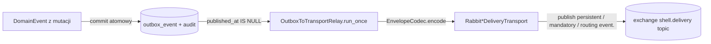

# Przepływ komendy w SHELL — dwie drogi + analiza transakcyjności

Status: analiza na podstawie aktualnego kodu (platforma + BC `project_service` jako przykład)
Data: 2026-09-01
Pokrycie: `shell/platform/**`, `shell/project_service/**`, `shell/{execution,user,session,scheduling,ingestion}_service/**` (wiring)
Uwaga: `command.md` opisuje model docelowy (refaktoryzacja); ten dokument opisuje **stan faktyczny** kodu.

---

## 0. Skrót koncepcyjny

W SHELL występują **dwa przepływy** dla komendy:

| Ścieżka | Tryb | Zasięg | Przenosi | Odpowiedź |
|---|---|---|---|---|
| **1. Synchroniczna** | `HTTP → Controller → CommandBus → Handler → UoW → Aggregate` | lokalnie w jednym BC | komendę jako obiekt w procesie | tak, bezpośrednio do caller'a |
| **2. Asynchroniczna** | `outbox → Relay → RabbitMQ → inbox → Processor → (Event|Command)Bus` | między BC | eventy **oraz** async-komendy | nie (fire-and-forget, eventual consistency) |

Komenda w sensie intencji żyje tylko na ścieżce synchronicznej (obiekt w RAM). Między BC migruje albo **event** (fakt dokonany), albo **async-komenda** (intencja) przez osobne tabele `outbox_command`/`inbox_command`. Kod po stronie odbiorcy dla obu form jest ten sam: bramka do lokalnego `CommandBus`/`EventBus`.

---

## 1. DROGA SYNRONICZNA (lokalna, ten sam BC)

Pełny łańcuch na przykładzie `POST /api/v1/projects/` w `project_service`.

### Przepływ krok po kroku

```mermaid
flowchart TD
    C[Klient / Frontend / CLI] -->|POST /projects X-Correlation-ID X-API-Key| M1[CorrelationIdMiddleware]
    M1 --> A[AuthMiddleware - X-API-Key]
    A --> R[router.py - FastAPI APIRouter]
    R -->|Depends get_core_container| CT[ProjectController]
    CT --> CB[CommandBus.dispatch CreateProjectCommand]
    CB -->|factory()| H[CreateProjectHandler]
    H --> U[SqlAlchemyProjectUnitOfWork]
    U -->|save| REPO[SqlProjectRepository]
    REPO --> AGG[Project.create]
    AGG -->|append_event| EV[ProjectCreatedEvent]
    U -->|commit| OUT[outbox_event + audit_event]
    AGG -->|ProjectId| H
    H --> CT
    CT -->|CreateProjectResponse 201| C
```

### Kroki i klasy

| # | Krok | Gdzie (plik:linia) | Co się dzieje |
|---|---|---|---|
| 1 | Request HTTP | `shell/project_service/framework/project/project/api/app.py:29` (`create_project_app`), middleware `:37-44` | `CorrelationIdMiddleware` ustawia `correlation_id` z nagłówka (`framework/api/middleware/correlation_id.py:16-39`), `AuthMiddleware` weryfikuje API key. |
| 2 | Routing | `shell/project_service/framework/project/project/api/router.py:28` (APIRouter), `:60-65` (`POST "/"`) | Endpoint wstrzykuje `ProjectController` przez `Depends(get_project_controller)` (`router.py:31-40`), który pobiera `CommandBus` z kontenera. |
| 3 | Controller | `shell/project_service/framework/project/project/api/controller.py:96-100` | `await self._command_bus.dispatch(CreateProjectCommand(name=..., repo_url=...))`. Kontroler nie ma logiki biznesowej. |
| 4 | CommandBus | `shell/platform/application/bus/command_bus.py:9-21` | Czynnik: `register(command_type, factory)` zapisuje fabrykę handlera; `dispatch(command)` → `factory()` → `await handler.handle(command)`. Słownik `dict[type, Callable]`. |
| 5 | Rejestracja | `shell/project_service/bootstrap/project/container/project_core_container.py:215-238` | `configure_project_container` rejestruje `CreateProjectCommand → create_project_handler_factory` (:236). Test importowy gwarantuje, że każda komenda ma handler. |
| 6 | Command DTO | `shell/project_service/application/project/project/commands/create_project_command.py:6-13` | `@dataclass(frozen=True, slots=True)`, walidacja strukturalna w `__post_init__`. |
| 7 | Handler | `shell/project_service/application/project/project/command_handlers/create_project_handler.py:27-45` | Generuje `ProjectId`, buduje VO, `Project.create(...)`, `async with unit_of_work: await unit_of_work.save(ProjectRepository, project)`. Zwraca `project_id`. |
| 8 | UnitOfWork (wejście) | `shell/platform/infrastructure/persistence/sql_alchemy_uow_base.py:117-129` | `__aenter__`: sprawdza **session scope** — w ścieżce synchronicznej scope jest `None`, więc tworzy **własną sesję** (`_deferred_commit = False`). |
| 9 | save + pull_events | `sql_alchemy_uow_base.py:111-115` | `repository(repo_type)` tworzy `SqlProjectRepository(self._active_session)` (`unit_of_work.py:25-35`), zapisuje agregat, potem `aggregate.pull_events()` (`aggregate_root.py:37-40`) i `stage_events(...)`. |
| 10 | Agregat | `shell/project_service/domain/project/aggregates/project/project.py:115-125` (`Project.create`), `:109-111` (`append_event ProjectCreatedEvent`) | Mutacja stanu + nagranie zdarzenia domenowego do bufora `AggregateRoot._events` (`shell/platform/domain/base/aggregate_root.py:27-35`). |
| 11 | commit | `sql_alchemy_uow_base.py:142-157` | `_write_staged_outbox()` (:159-190) w **tej samej transakcji**: mapuje event (`ReflectiveIntegrationMapper` → `IntegrationEvent`), `IntegrationEventSerializer().to_envelope(...)`, `session.add(outbox_event)` + `session.add(audit_event)`. Potem `session.commit()`. Efekt atomowy: **stan agregatu + outbox + audit**. |
| 12 | Odpowiedź | `controller.py:100` → `app.py` | Zwraca `CreateProjectResponse(id=...)` ze statusem 201. Błąd domenowy → `domain_error_handler` (`app.py:45`). |

**Kluczowa cecha ścieżki synchronicznej:** komenda nigdy nie jest persistowana. Jest obiektem w pamięci; gwarancja siedzi w handlerze + UoW.

---

## 2. DROGA ASYNCHRONICZNA (między BC: outbox → broker → inbox)

Dwa warianty realizują ten sam szkielet, ale z osobnymi tabelami/kanałami:
- **Eventy** (`outbox_event`/`inbox_event`, routing `event.<name>`) — główny kanał integracji.
- **Komendy async** (`outbox_command`/`inbox_command`, routing `command.<name>`) — intencja wykonania u innego BC.

### 2a. Producent (strona nadawcy)



| # | Krok | Plik:linia | Szczegóły |
|---|---|---|---|
| 1 | Zapis do outboxa | `sql_alchemy_uow_base.py:159-190` | Ten sam commit co efekt (patrz punkt 11 ścieżki sync). Wiersz ma `published_at = NULL` do czasu potwierdzonego transportu. |
| 2 | Relay | `shell/platform/infrastructure/messaging/event_transport/outbox_to_transport_relay.py:73-96` | `run_once()` w **jednej transakcji**: `SELECT ... WHERE published_at IS NULL ... FOR UPDATE SKIP LOCKED` (tylko PG, `:71/81-82`), buduje `IntegrationEventDeliveryEnvelope` (:98-112), dla każdego: `await transport.deliver(envelope)`, po czym ustawia `published_at` i `commit()` (:93-95). |
| 3 | Transport | `shell/platform/infrastructure/messaging/event_transport/rabbit/rabbit_event_delivery_transport.py:45-66` | `exchange.publish(Message(..., delivery_mode=PERSISTENT), routing_key=f"event.{name}", mandatory=True)`; publisher confirms + `on_return_raises`. Analogiczny command: `command_transport/rabbit/rabbit_command_delivery_transport.py:45-66`. |
| 4 | Envelope | `command_transport/envelope_codec.py:17-72` (event odpowiednio) | JSON: kind, command_id, command_name, source_service, target_service, issued_at, schema_version, payload, correlation_id, causation_id. |

**Wariant komendy po stronie producenta** (klasy działają, ale patrz §4 — nie podłączone w produkcji):
- `shell/platform/application/ports/command/async_command_dispatcher.py:8` — port `AsyncCommandDispatcher`.
- `shell/platform/infrastructure/messaging/command/sql_command_outbox_writer.py:114-148` (`SqlAsyncCommandDispatcher`) — rozwiązuje `CommandContract`, waliduje `target_service`, `writer.append(scope.session, ...)` **bez commita** (atomy z UoW handlera).
- `sql_command_outbox_writer.py:35-78` (`SqlCommandOutboxWriter.append`, never commit), `:81-111` (`StandaloneSqlCommandOutboxWriter` — własny commit, poza UoW), legacy `sql_command_outbox_publisher.py:25-67` (własny commit).
- `CommandOutboxToTransportRelay`: `command_transport/outbox_to_transport_relay.py:54-96` (analogiczny do eventowego).

### 2b. Konsument (strona odbiorcy)

```mermaid
flowchart TD
    EX[(exchange shell.delivery)] -->|routing event.# / command.#| Q[(durable queue per BC)]
    Q --> HCON[RabbitInboxConsumer._on_message]
    HCON -->|EnvelopeCodec.decode + insert inbox + commit| IB[(inbox_event / inbox_command PENDING)]
    HCON -->|ack| Q
    IB --> PW[PollingWorker.poll]
    PW --> CLAIM[InboxClaimService.claim_batch]
    CLAIM -->|Transakcja A: PROCESSING + claimed_by + lease_until + commit| PROC[InboxProcessorBase._process_claimed_row]
    PROC -->|session scope / deserialize / tracing| DISP[EventInboxProcessor -> EventBus | CommandInboxProcessor -> CommandBus]
    DISP --> H[Handler, UoW w deferred mode]
    H -->|efekt + lokalny outbox + PROCESSED| ONE[Transakcja B: pojedynczy commit]
```

| # | Krok | Plik:linia | Szczegóły |
|---|---|---|---|
| 1 | Consumer → inbox | `event_transport/rabbit/rabbit_event_inbox_consumer.py:74-118` (command analogicznie `command_transport/rabbit/rabbit_command_inbox_consumer.py:74-118`) | `start()` deklaruje durable queue i binduje routing (domyślnie **`event.#`/`command.#`**). `_on_message`: kodował → `_persist(envelope)` → **insert + commit do inboxa** → `ack()`. Redeliveria idempotentna: `pg_insert(...).on_conflict_do_nothing()` + `UniqueConstraint(source_service, outbox_id)` (`event_delivery.py:49-53`, `command_delivery.py:56-60`). |
| 2 | Polling | `shell/platform/infrastructure/messaging/polling_worker.py:62-113` + `event_worker.py:18-63` | `run_delivery_workers` startuje consumerów i pętle `PollingWorker(task.run_once)`. Worker zapisuje heartbeat. |
| 3 | Claim (transakcja A) | `shell/platform/infrastructure/messaging/inbox/inbox_claim_service.py:72-119` | `claim_batch`: `SELECT ... status IN (PENDING, RETRY) AND next_attempt_at <= now OR status=PROCESSING AND lease_until < now ... FOR UPDATE SKIP LOCKED` (PG), ustawia `PROCESSING`/`claimed_by`/`lease_until`, **commit**. Krótka transakcja, zamek nie trzymany przez handler. |
| 4 | Walidacja + deserializacja + tracing | `inbox/inbox_processor_base.py:218-259` (`_process_claimed_row`) | `EnvelopeValidator.validate(...)` → `_deserialize(row)` → ustawienie `correlation_id_var`/`causation_id_var`. Błędy → `_schedule_failure` (RETRY/DLQ, `:416-463`; `max_retries=3`, backoff wykładniczy `:465-471`). |
| 5 | Przetwarzanie (transakcja B) | `inbox/inbox_processor_base.py:261-314` (`_process_in_transaction`) | Procesor **właściciel sesji**: `DeliverySessionScope(session)` → `set_session_scope`. Dedup: `_is_duplicate` przez `ProcessedDeliveryStore` (:316-319). Dispatch: event → `EventBus.publish` (`event/processor/event_inbox_processor.py:105-106`), komenda → `CommandBus.dispatch` (`command/processor/command_inbox_processor.py:102-103`). |
| 6 | Handler w session scope | `sql_alchemy_uow_base.py:117-123` (`__aenter__` wykrywa aktywny scope) | UoW handlera **współdzieli sesję** procesora i **odracza commit** (`_deferred_commit=True`, `commit()` = flush, `:147-150`). `DeliverySessionScope`: `shell/platform/application/context/session_scope.py:26-49`. |
| 7 | Ack atomowy | `inbox_processor_base.py:321-341` + `:307-311` | `_acknowledge_in_session`: warunkowy `UPDATE ... WHERE id AND status=PROCESSING AND claimed_by=worker` → `PROCESSED`. Potem `session.commit()` — **jeden commit czysci: efekt biznesowy + lokalny outbox (ponowny `_write_staged_outbox` w deferred) + status PROCESSED**. `rowcount=0` → `rollback` → `"failed"` (lease zgubiony). |
| 8 | Retry/DLQ | `inbox_processor_base.py:416-463` | `next_retry_count >= max_retries` lub `UNSUPPORTED_SCHEMA_VERSION` → `DEAD_LETTER`; w przeciwnym razie `RETRY` + `next_attempt_at = now + backoff`. |

**Idempotencja zamyka at-least-once:** broker może dostarczyć 2× (relay duplikuje przy awarii między publish a commit), consumer może zapisać 2× wiersz (unikalność `source_service+outbox_id`), processor może przetworzyć 2× — ochronę daje `processed_delivery` (`processed_delivery_store.py`), zapisywany atomowo z efektem (`:300-305`), sprawdzany przed dispatch (`:273`).

---

## 3. Wiring produkcyjny — co faktycznie jest podłączone

Na bazie `shell/project_service/bootstrap/project/main.py:63-82` i kontenera `project_core_container.py`:

| Komponent | Podłączony w produkcji? | Uwagi |
|---|---|---|
| `EventOutboxToTransportRelay` | ✅ tak (`main.py:80`, `outbox_relay=...`) | Jedyne relay w każdej pętli `run_delivery_workers` wszystkich BC. |
| `RabbitEventInboxConsumer` + `EventInboxProcessor` | ✅ tak (`main.py:65-69`) | Kanał eventowy domknięty. |
| `RabbitCommandInboxConsumer` + `CommandInboxProcessor` | ✅ tak (odbiór, `main.py:70-74`) | Strona odbiorcy async-komend działa. |
| `CommandOutboxToTransportRelay` | ❌ **nie** | Nigdzie w `run_delivery_workers` — tylko w testach (`tests/platform/integration/sql_sqlite/test_command_inbox_processor.py:97`). |
| `SqlAsyncCommandDispatcher` / `SqlCommandOutboxWriter` / `StandaloneSqlCommandOutboxWriter` / `SqlCommandOutboxPublisher` | ❌ **nie** (brak wywołania w kodzie produkcyjnym) | Klasy istnieją, używane wyłącznie w testach / `__init__`. |
| `SynchronousCommandPort` (HTTP/gRPC cross-BC) | ❌ nie istnieje | Port nieobecny w `application/ports/`; jedyne cross-BC HTTP to read-only providery (`graph_definition_provider_http_adapter.py`, `session_query_provider_http_adapter.py`). |

**Wniosek (najważniejszy):** async-komenda ma **domkniętą stronę odbioru, ale otwarty tor nadawczy**. Żaden BC w produkcji nie zapisuje komendy do `outbox_command`, a nawet gdyby zapisał, nie startuje `CommandOutboxToTransportRelay` — wiersz zostałby w `outbox_command` bez `published_at` na zawsze (komenda „zamarza" w bazie, nikt jej nie publikuje).

---

## 4. Analiza transakcyjności — gdzie NIE zgubimy, gdzie grozi utrata

Zasada bazowa SHELL: **at-least-once** (nie exactly-once). Oceniamy każdy punkt, w którym komenda/event mogłaby zniknąć albo zostać zduplikowana.

### 4.1 Producent (ścieżka sync + zapis outboxa) — DOBRZE

| Ogniwo | Mechanizm | Utracić? | Utrudnienie |
|---|---|---|---|
| Mutacja + outbox + audit | jedna transakcja `sql_alchemy_uow_base.py:142-190` | ❌ nie atomowo | crash przed commitem → rollback → spójnie (brak efektu i brak outboxa). |
| Błąd serializacji eventu | `IntegrationEventSerializer` / relay `_to_envelope` | ✅ możliwe, ale **zablokowane jawnie** | Publisheray logują `critical` i `raise` — wiadomość nie jest cicho porzucana (dokumentacja: `transactional-outbox.md`, publisheray „nieudana serializacja"). |

### 4.2 Relay (outbox → broker) — UWAGA: duplikaty i długie locki

| Punkt | Ryzyko | Ocena |
|---|---|---|
| `FOR UPDATE SKIP LOCKED` trzymane przez całe wywołanie sieciowe brokera (`outbox_to_transport_relay.py:74-95`) | wolny broker → długie locki DB na całej partii | ⚠️ nie utrata (wiersze nadal w DB), ale presja na DB / możliwy timeout sesji. Zgodne z `command.md §8`. |
| Publikacja częściowa partii: deliver OK dla wiersza 1..N-1, błąd dla N | wyjątek → brak `commit()` → **żaden** wiersz nie dostaje `published_at` → N-1 opublikowanych ponownie w następnej rundzie | ⚠️ **duplikaty** w brokerze (nie utrata). Konsumenci deduplkują przez unique `(source_service, outbox_id)` + `processed_delivery`. |
| Crash po publish, przed commit | to samo co wyżej | ⚠️ duplikat, bezpieczny dedupem. |
| Błąd transportu/encode → wyjątek z `deliver` | wiersz zostaje `PENDING` (`published_at IS NULL`) → retry w kolejnym poll | ✅ nie utrata (to jest zamierzony retry). |
| Brak `attempt_count/next_attempt_at/last_error` na outboxie (`event_delivery.py:26-41`, `command_delivery.py:26-48`) | zatruty wiersz (np. niekodowalny payload) blokuje/opóźnia całą partię na każdym poll; brak backoffu i DLQ po stronie outboxa | ⚠️ nie utrata, ale brak dojrzałego retry i „gorącego punktu" w batchu. |

### 4.3 Broker RabbitMQ — właściwie skonfigurowany

| Punkt | Ocena |
|---|---|
| `publisher_confirms=True` + `mandatory=True` + `on_return_raises=True` (`rabbit_*_delivery_transport.py:73-76`) | ✅ nieunroutable message nie jest „pozornym sukcesem": wyjątek → wiersz nieoznaczony → retry. |
| Persistence PERSISTENT + durable exchange/queue | ✅ przetrwanie restartu brokera. |
| **Brak dead-letter dla consumerów** | ⚠️ patrz 4.4. |

### 4.4 Consumer (broker → inbox) — JEDYNY PRAWDZIWY PUNKT UTRATY

| Punkt | Ryzyko | Ocena |
|---|---|---|
| Decode failure → `message.reject(requeue=False)` (`rabbit_event_inbox_consumer.py:77-80`, `rabbit_command_inbox_consumer.py:77-80`) | zły JSON / zły `kind` / braki pól → **wiadomość odrzucona bez requeue → utracona**. Brak DLQ (`reject(requeue=False)` bez dead-letter exchange) | ❌ **UTRATA** (at-most-once dla uszkodzonych kopert). |
| Insert/commit nieudany → `message.reject(requeue=True)` | DB chwilowo niedostępna → redelivery | ✅ nie utrata; ryzyko pętli hot redelivery przy trwałej awarii DB (brak max-delivery / TTL) — nie utrata, ale backlog. |
| Crash po commit inboxa, przed ack | redelivery → `on_conflict_do_nothing` → wiersz już jest → ack | ✅ nie utrata, idempotentny. |
| Ack po trwałym insert (dobre praktyki) | — | ✅ zgodnie z wymogiem „ack dopiero po trwałym zapisie do inboxa". |

### 4.5 Processor (inbox → handler) — NAJBEZPIECZNIEJSZE OGNIWO

| Punkt | Mechanizm | Ocena |
|---|---|---|
| Efekt + lokalny outbox + ack w jednym commicie (transakcja B) | `inbox_processor_base.py:307-311` + deferred UoW | ✅ **brak utraty i brak podwójnego efektu**: awaria przed commitem cofa wszystko; awaria po commicie → wiersz `PROCESSED`. |
| Lease wygasł / reclaim | `inbox_claim_service.py:96-99` (PROCESSING & lease_until<now) + `_acknowledge_in_session` warunkowe (rowcount) | ✅ rowcount=0 → rolback → niepotwierdzanie cudzego rekordu. |
| Handler rollback → `scope.rolled_back` | `sql_alchemy_uow_base.py:192-199` + `inbox_processor_base.py:292-298` | ✅ zamiast ack — `_schedule_failure(RETRY)`. |
| Dedup `processed_delivery` | `:273` (przed dispatch) + `:300-305` (atomowo z efektem) | ✅ double processing zablokowany w tej samej bazie. |
| RETRY/DLQ z backoffem | `:416-471` | ✅ wyczerpanie retry → `DEAD_LETTER` z logiem `critical`. |

### 4.6 Ścieżka sync specyficznie — brak idempotencji na API

| Punkt | Ryzyko | Ocena |
|---|---|---|
| `POST /projects` nie ma id/key dedup (`router.py:60-65`) | crash po commicie a przed odpowiedzią (lub zwykła retry klienta) → caller widzi błąd, ponawia → **drugi projekt** | ⚠️ **duplikaty** efektu synchronicznego (inny problem niż utrata: brak request-id / no idempotency-key na ścieżce HTTP). `CreateProjectCommand` nie niesie żadnego stabilnego id. |
| Komenda w RAM (nie persistowana) | crash w trakcie handlera → komenda znika, efekt nie | ✅ akceptowalne dla semantyki sync HTTP (klient ponawia). |

### 4.7 Podsumowanie ryzyk „zgubienia komendy"

Pogrubione = realne luki w obecnym kodzie.

1. **❌ Utwardzona utrata na consumer: `reject(requeue=False)` dla niezdekodowanych kopert** — wiadomość ginie bez śladu (brak DLQ). Rozwiązanie: dead-letter exchange/kolejka albo zapis „poison" do bazy przed reject.
2. **❌ Async-komenda nie ma toru nadawczego w produkcji**: brak producenta (nikt nie woła `SqlAsyncCommandDispatcher`/writer) **oraz** brak `CommandOutboxToTransportRelay` w `run_delivery_workers` wszystkich BC. Komenda zapisana do `outbox_command` (np. ręcznie w DB) nigdy nie zostałaby opublikowana → **utrata „po cichu" przez brak workera**. To największa rozbieżność względem `command.md` (P0/P1).
3. ⚠️ **Duplikaty z relay** przy częściowym błędzie partii / crash między publish a commit — łagodzone dedupem, ale nie eliminowane na poziomie producenta.
4. ⚠️ **Duplikaty sync API** — brak idempotency-key.
5. ⚠️ Routing szeroki `event.#`/`command.#` (`rabbit_*_inbox_consumer.py:52`) — każdy BC odbiera wszystko; potencjalna kolizja wire-name (registry oparte o `__name__` klasy, `command_registry.py:19-38`) i niepotrzebny ruch.
6. ⚠️ Long lock w relay podczas I/O sieci (`outbox_to_transport_relay.py:74-95`) — nie utrata, ale ryzyko operacyjne.
7. ⚠️ Outbox bez retry-backoff/DLQ po stronie producenta — zatruty wiersz może blokować partię na długo.

**Miejsca, w których komenda/event NIE jest tracona (dobre praktyki obecne):**
- UoW deferred + `DeliverySessionScope` (`session_scope.py:26-49`) — jeden commit na efekt+outbox+ack;
- dedup przy zapisie inboxa (unikalność `source_service+outbox_id`);
- dedup przed dispatch (`processed_delivery`);
- lease/claim/reclaim z warunkowym ack;
- publisher confirms + mandatory + re-raise na błędach serializacji;
- retry/DLQ inbox z backoffem i `max_retries`.

---

## 5. Rekomendacje (najmniejsze do największych)

1. **Consumer DLQ**: konfiguracja dead-letter exchange/queue albo fallback `PersistAndRejectPoison`, aby uszkodzona koperta nie znikała.
2. **Domknąć tor komend**: włączyć `CommandOutboxToTransportRelay` jako osobny worker w `run_delivery_workers` BC, które chcą wysyłać komendy; podłączyć `SqlAsyncCommandDispatcher` do portu i użyć w handlerze (zgodnie z `command.md` P0/P1).
3. **Idempotency-key na ścieżce sync API** (np. `Idempotency-Key` → dedup po kluczu).
4. **Relay**: rozbić na krótką transakcję claim + publish poza transakcją + warunkowy `mark published` (jak w `command.md §8`), ograniczy duplikaty i długie locki.
5. **Retry state outboxa** (`attempt_count`, `next_attempt_at`, `last_error`) + DLQ po stronie outboxa (`command.md §8`).
6. **Routing per-komenda** (`command.<target>.<name>` zamiast `command.#`) — `command.md §9`.
7. **Stabilny wire-name** zamiast `__name__` klasy (`command.md §4`).