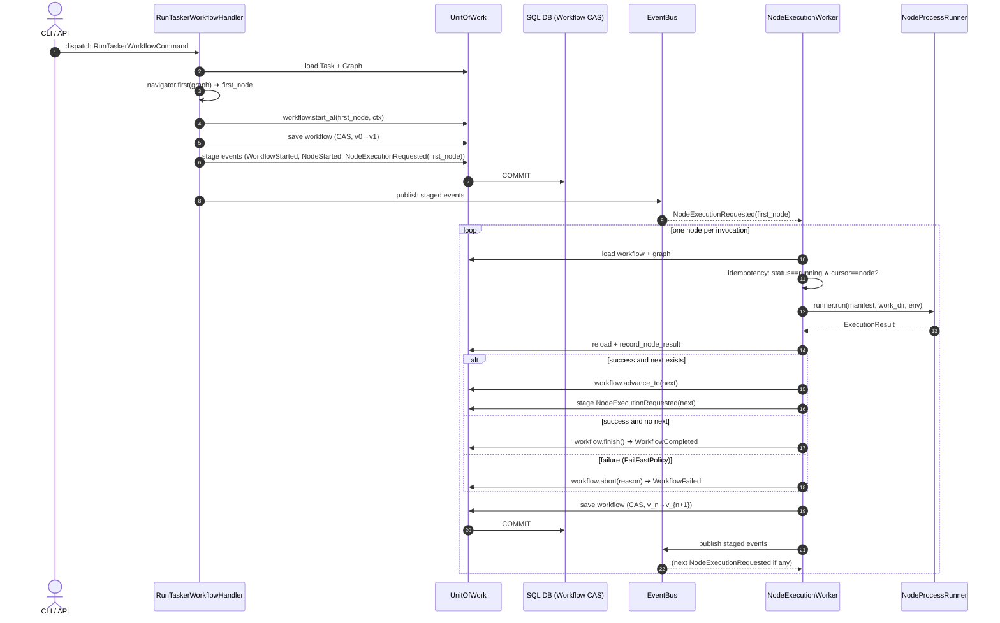
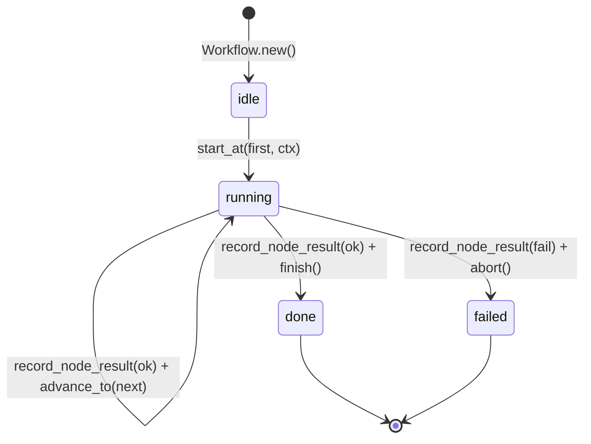

# Workflow Execution Flow — Step-by-Step (Phase 14)

This document describes the runtime architecture of the Tasker workflow
execution path after the Phase 14 refactor. It is the primary reference
for engineers extending or operating the workflow runtime.

> See [ADR-0004](../adr/ADR-0004_step_by_step_node_execution.md) for the
> formal decision record and rejected alternatives.

---

## 1. Building Blocks

| Layer            | Component                              | Responsibility                                                            |
|------------------|----------------------------------------|---------------------------------------------------------------------------|
| domain (VO)      | `WorkflowCursor`                       | Immutable execution pointer (`current_node_id`).                          |
| domain (VO)      | `WorkflowExecutionContext`             | Captured `work_dir` + `correlation_id` for tracing.                       |
| domain (entity)  | `Workflow`                             | Aggregate root; owns `NodeState`s, `NodeResult`s, the cursor and version. |
| domain (service) | `NodeNavigator`                        | Pluggable graph-traversal policy (default `LinearNodeNavigator`).         |
| domain (service) | `NodeExecutionPolicy`                  | Pluggable failure-decision policy (default `FailFastPolicy`).             |
| domain (service) | `CompensationHandler`                  | Optional Saga compensation hook (default `NoOpCompensationHandler`).      |
| application      | `RunTaskerWorkflowHandler`             | Bootstraps the workflow + emits the **first** `NodeExecutionRequested`.   |
| application      | `NodeExecutionWorker`                  | Process Manager: handles **one** `NodeExecutionRequested` per call.       |
| infrastructure   | `SqlWorkflowRepository`                | CAS save (optimistic locking) on `version`.                               |
| infrastructure   | `EventBus` + `EventBusPublisher`       | In-process re-delivery of `NodeExecutionRequested`.                       |

---

## 2. End-to-End Sequence



The loop terminates when the worker either calls `workflow.finish` or
`workflow.abort` — both clear the cursor and emit a terminal event.

---

## 3. State Machine



**Invariants enforced by the aggregate:**

* `start_at` requires `idle`; double-starts raise `InvalidWorkflowTransition`.
* `advance_to` requires `running` **and** an active cursor.
* `finish` requires `running`.
* `abort` requires `idle` or `running`.
* The cursor is always cleared (set to `WorkflowCursor.empty()`) on
  `finish` and `abort`.
* `record_node_result` never moves the cursor — it only appends a result
  and updates the matching `NodeState`. Callers must follow it with one
  of `advance_to` / `finish` / `abort`.

---

## 4. Idempotency Model (Three-Tier Defence in Depth)

```mermaid
flowchart TD
    A[NodeExecutionRequested arrives] --> B{Status == running?}
    B -- no --> Z[Drop silently]
    B -- yes --> C{Cursor.points_to event.node_id?}
    C -- no --> Z
    C -- yes --> D[Run subprocess]
    D --> E[Reload workflow]
    E --> F{Status == running\nand cursor matches?}
    F -- no --> Z
    F -- yes --> G[record_node_result + decide next]
    G --> H[save with CAS WHERE version = v]
    H -- conflict --> I[Log + drop\n(WorkflowConcurrentlyModified)]
    H -- ok --> J[Publish staged events]
```

The three tiers are independent and complementary:

1. **Cursor guard** — `WorkflowCursor.points_to(node_id)` ensures we only
   process the node the workflow is currently anchored on. Stale events
   from prior steps are dropped.
2. **Status guard** — terminal workflows (`done`, `failed`) ignore any
   re-delivered events.
3. **CAS guard** — the SQL repository performs `UPDATE workflow ... WHERE
   id = :id AND version = :v`. A concurrent writer that already advanced
   the workflow will cause `rowcount = 0` and the worker raises
   `WorkflowConcurrentlyModified` (logged and swallowed).

---

## 5. Extension Points

The worker code is **closed for modification, open for extension**. Plug
in new behaviour by swapping any of these Protocol implementations in
`CoreContainer`:

| Strategy / Hook         | Default                      | Examples of pluggable variants                                               |
|-------------------------|------------------------------|------------------------------------------------------------------------------|
| `NodeNavigator`         | `LinearNodeNavigator`        | `ParallelFanOutNavigator`, `ConditionalNavigator`, `DAGNavigator`            |
| `NodeExecutionPolicy`   | `FailFastPolicy`             | `RetryPolicy(max_attempts=3)`, `ContinueOnErrorPolicy`, `BackoffPolicy`      |
| `CompensationHandler`   | `NoOpCompensationHandler`    | `ReverseTransactionsCompensation`, `NotifyOpsCompensation`                   |

Adding a parallel-branch executor is a navigator-only change: emit
multiple `NodeExecutionRequested` events from `_advance_or_finish` and
let the EventBus deliver them concurrently. The worker logic stays
identical.

---

## 6. Persistence Schema (Phase 14 additions)

Migration `006_workflow_cursor.py` adds four columns to `workflow`:

| Column            | Type            | Purpose                                                  |
|-------------------|-----------------|----------------------------------------------------------|
| `current_node_id` | `VARCHAR(255)`  | Indexed cursor; `NULL` means cleared (idle / terminal).  |
| `work_dir`        | `VARCHAR(1024)` | Captured execution context (work directory).             |
| `correlation_id`  | `VARCHAR(64)`   | Captured execution context (tracing).                    |
| `version`         | `INTEGER`       | Optimistic concurrency token (CAS on save).              |

`SqlWorkflowRepository.save` is the single source of `version`
increments — aggregate methods never modify it. Initial inserts bump
`0 → 1`; subsequent saves issue an atomic `UPDATE ... WHERE version =
:expected SET version = :expected + 1`. Conflicts raise
`WorkflowConcurrentlyModified`.

The in-memory repository (`InMemoryWorkflowRepository`) mirrors the
semantics so unit tests behave identically to integration tests.

---

## 7. Event Catalogue

| Event                       | When emitted                                          |
|-----------------------------|-------------------------------------------------------|
| `WorkflowStarted`           | `Workflow.start_at` (idle → running)                  |
| `NodeStarted`               | `Workflow.start_at` and `Workflow.advance_to`         |
| `NodeExecutionRequested`    | After kickoff and after every successful advance      |
| `NodeCompleted`             | `Workflow.record_node_result(status=done)`            |
| `NodeFailed`                | `Workflow.record_node_result(status=failed)`          |
| `NodeAdvanced`              | `Workflow.advance_to` (cursor moved between nodes)    |
| `WorkflowCompleted`         | `Workflow.finish` (terminal: done)                    |
| `WorkflowFailed`            | `Workflow.abort` (terminal: failed)                   |

All events extend `DomainEvent(occurred_at, schema_version=1)` so future
schema migrations can be additive (versioned consumers).

---

## 8. Glossary

* **Cursor** — `WorkflowCursor` value object pointing at the node
  currently anchored as "to be processed". `None` means inactive.
* **Step** — one round-trip of `NodeExecutionRequested` →
  `NodeExecutionWorker.handle` → save + emit next event.
* **Process Manager / Saga** — pattern where a long-running business
  process is decomposed into short, durable, idempotent steps connected
  by domain events.
* **CAS** — compare-and-swap; database-level optimistic lock via
  `UPDATE ... WHERE version = :expected`.
* **Strategy slot** — Protocol-typed dependency that can be swapped at
  composition time without touching consumer code (`NodeNavigator`,
  `NodeExecutionPolicy`, `CompensationHandler`).

---

## 9. Trade-offs and Open Questions

* **Latency** — step-by-step adds DB round-trips per node compared to
  the old fan-out. For PoC node counts (≤ a few dozen) the cost is
  negligible; if it ever matters, batch persistence at the
  `NodeExecutionWorker` boundary.
* **In-process EventBus** — the bus delivers `NodeExecutionRequested`
  synchronously inside `EventPublisher.publish`. Long-running graphs
  therefore form a recursive call stack of bounded depth equal to graph
  length. For very large graphs (> ~500 nodes) we may want to switch the
  bus to a queue-backed dispatcher; out of scope for the PoC.
* **Cross-process durability** — the outbox table (`OutboxEventModel`)
  stages events transactionally with workflow saves. Replaying the
  outbox after a crash will redeliver `NodeExecutionRequested`, which
  the idempotency tiers handle correctly.

---

## 10. Quick References

* Source files
  * Domain: `shell/domain/entities/workflow.py`,
    `shell/domain/value_objects/workflow_cursor.py`,
    `shell/domain/value_objects/workflow_execution_context.py`,
    `shell/domain/services/{node_navigator,node_execution_policy,compensation_handler}.py`
  * Application: `shell/application/command_handlers/run_tasker_workflow_handler.py`,
    `shell/application/event_handlers/node_execution_worker.py`
  * Infrastructure: `shell/infrastructure/persistence/sql/repositories/__init__.py`,
    `shell/infrastructure/persistence/memory/memory.py`
  * Migrations: `shell/infrastructure/persistence/migrations/sql/versions/006_workflow_cursor.py`
* Tests
  * `shell/tests/unit/domain/test_workflow_cursor.py`
  * `shell/tests/unit/domain/test_workflow_step_machine.py`
  * `shell/tests/unit/domain/test_node_navigator.py`
  * `shell/tests/unit/domain/test_node_execution_policy.py`
  * `shell/tests/unit/application/test_node_execution_worker.py`
  * `shell/tests/e2e/cli/test_tasker_full_graph.py`
