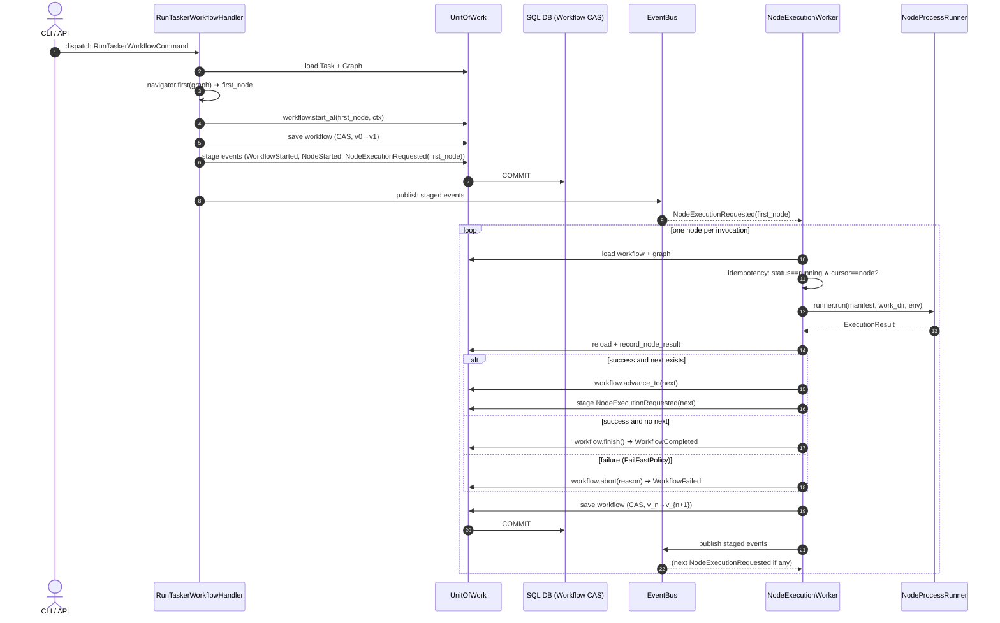
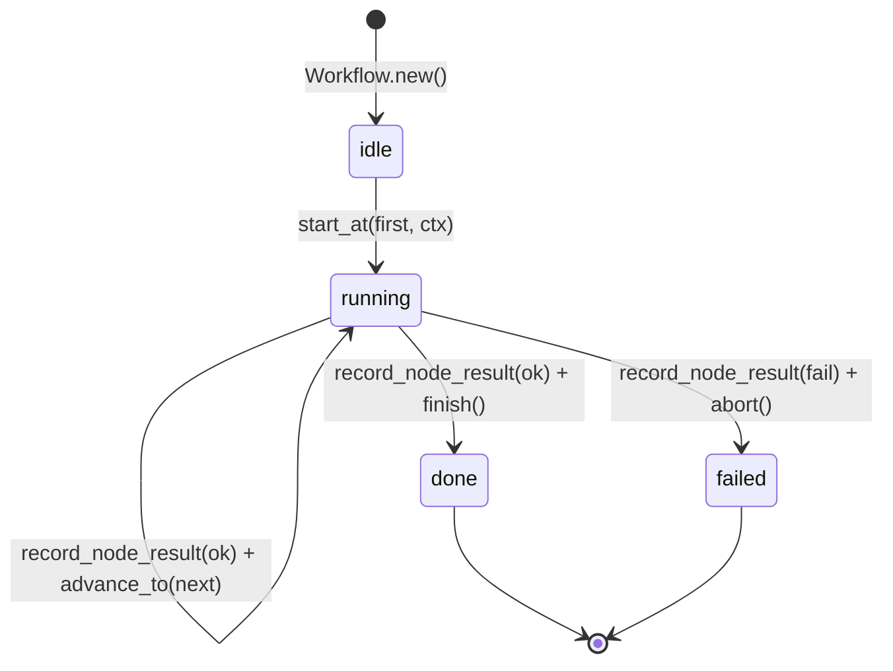

### __init__.py
```
```

### application/__init__.py
```
```

### application/bus/__init__.py
```
```

### application/bus/command_bus.py
```
from __future__ import annotations
from typing import Any, Callable


class CommandBus:
    """Przesyła komendy do dynamicznie rozwiązanych handlerów."""

    def __init__(self) -> None:
        self._handler_factories: dict[type[Any], Callable[[], Any]] = {}

    def register(self, command_type: type[Any], factory: Callable[[], Any]) -> None:
        self._handler_factories[command_type] = factory

    async def dispatch(self, command: Any) -> Any:
        factory = self._handler_factories[type(command)]
        handler = factory()
        return await handler.handle(command)
```

### application/bus/event_bus.py
```
from __future__ import annotations
from typing import Any, Callable


class EventBus:
    """Publikuje zdarzenia domenowe do wielu subskrybentów."""

    def __init__(self) -> None:
        self._handler_factories: dict[type[Any], list[Callable[[], Any]]] = {}

    def subscribe(self, event_type: type[Any], factory: Callable[[], Any]) -> None:
        if event_type not in self._handler_factories:
            self._handler_factories[event_type] = []
        self._handler_factories[event_type].append(factory)

    async def publish(self, events: list[Any]) -> None:
        for event in events:
            factories = self._handler_factories.get(type(event), [])
            for factory in factories:
                handler = factory()
                await handler.handle(event)
```

### application/bus/event_bus_publisher.py
```
from shell_ddd.application.bus.event_bus import EventBus


class EventBusPublisher:
    """Adapts EventBus to the EventPublisher port."""

    def __init__(self, event_bus: EventBus) -> None:
        self._event_bus = event_bus

    async def publish(self, events: list) -> None:
        await self._event_bus.publish(events)
```

### application/bus/query_bus.py
```
from __future__ import annotations
from typing import Any, Callable


class QueryBus:
    """Przesyła zapytania do dynamicznie rozwiązanych handlerów."""

    def __init__(self) -> None:
        self._factories: dict[type[Any], Callable[[], Any]] = {}

    def register(self, query_type: type[Any], factory: Callable[[], Any]) -> None:
        self._factories[query_type] = factory

    async def dispatch(self, query: Any) -> Any:
        factory = self._factories[type(query)]
        handler = factory()
        return await handler.handle(query)
```

### application/command_handlers/__init__.py
```
```

### application/command_handlers/archive_envelope_handler.py
```
"""ArchiveEnvelopeHandler — marks an envelope as archived."""
from __future__ import annotations

from typing import TYPE_CHECKING

from shell_ddd.domain.exceptions import EnvelopeNotFound
from shell_ddd.domain.value_objects.envelope_status import EnvelopeStage
from shell_ddd.domain.value_objects.ids import EnvelopeId

if TYPE_CHECKING:
    from shell_ddd.application.commands.commands import ArchiveEnvelopeCommand
    from shell_ddd.application.ports.ports import Clock, EventPublisher, UnitOfWork


class ArchiveEnvelopeHandler:
    def __init__(
        self,
        uow: UnitOfWork,
        clock: Clock,
        event_publisher: EventPublisher,
    ) -> None:
        self._uow = uow
        self._clock = clock
        self._event_publisher = event_publisher

    async def handle(self, cmd: ArchiveEnvelopeCommand) -> None:
        env_id = EnvelopeId(cmd.envelope_id)
        now = self._clock.now()

        async with self._uow as uow:
            envelope = await uow.envelopes.get_by_id(env_id)
            if envelope is None:
                raise EnvelopeNotFound(cmd.envelope_id)

            archive_uri = await uow.envelope_archive.archive(envelope)
            envelope.archive_uri = archive_uri
            envelope.transition_stage(EnvelopeStage.ARCHIVED, now)
            await uow.envelopes.save(envelope)
            await uow.commit()
```

### application/command_handlers/bootstrap_runner_config_handler.py
```
"""BootstrapRunnerConfigHandler."""
from __future__ import annotations

import json
from typing import TYPE_CHECKING

from shell_ddd.domain.entities.runner_config import RunnerConfig
from shell_ddd.domain.value_objects.hash import Hash

if TYPE_CHECKING:
    from shell_ddd.application.commands.commands import BootstrapRunnerConfigCommand
    from shell_ddd.application.ports.ports import Clock, IdGenerator, UnitOfWork


class BootstrapRunnerConfigHandler:
    def __init__(self, uow: UnitOfWork, clock: Clock, id_gen: IdGenerator) -> None:
        self._uow = uow
        self._clock = clock
        self._id_gen = id_gen

    async def handle(self, cmd: BootstrapRunnerConfigCommand) -> str:
        serialized = json.dumps(cmd.body, sort_keys=True)
        config_hash = Hash.of(serialized)
        async with self._uow as uow:
            config = RunnerConfig.new(
                id_=self._id_gen.new_runner_config_id(),
                package_name=cmd.package_name,
                kind=cmd.kind,
                body=cmd.body,
                config_hash=config_hash,
                now=self._clock.now(),
            )
            await uow.runner_configs.save(config)
            await uow.commit()
        return config.id.value
```

### application/command_handlers/import_task_handler.py
```
"""ImportTaskHandler — imports a task from a markdown file.

This handler is intentionally ignorant of the Graph aggregate: after a Task
is persisted, the ``TaskCreated`` event triggers ``BuildGraphOnTaskCreated``
which constructs the appropriate Graph from a TemplateGraph.
"""
from __future__ import annotations

from typing import TYPE_CHECKING

from shell_ddd.domain.entities.task import Task
from shell_ddd.domain.value_objects.task_body import TaskBody
from shell_ddd.domain.value_objects.task_name import TaskName

if TYPE_CHECKING:
    from shell_ddd.application.commands.commands import ImportTaskCommand
    from shell_ddd.application.ports.ports import (
        Clock,
        EventPublisher,
        IdGenerator,
        Logger,
        TaskLoader,
        UnitOfWork,
    )


class ImportTaskHandler:
    def __init__(
            self,
            uow: UnitOfWork,
            clock: Clock,
            id_gen: IdGenerator,
            task_loader: TaskLoader,
            event_publisher: EventPublisher,
            logger: Logger,
    ) -> None:
        self._uow = uow
        self._clock = clock
        self._id_gen = id_gen
        self._task_loader = task_loader
        self._event_publisher = event_publisher
        self._logger = logger

    async def handle(self, cmd: ImportTaskCommand) -> str:
        body = TaskBody(await self._task_loader.load(cmd.md_path))
        name = TaskName(cmd.task_name)
        current_time = self._clock.now()
        async with self._uow as uow:
            existing = await uow.tasks.get_current_by_name(name)
            if existing:
                existing.supersede()
                await uow.tasks.save(existing)
            task = Task.create(
                id_=self._id_gen.new_task_id(),
                name=name,
                body=body,
                now=current_time,
            )
            await uow.tasks.save(task)
            uow.stage_events(task.pull_events())
            await uow.commit()
        await self._event_publisher.publish(uow.events)
        self._logger.info("Event published", task_id=task.id.value)
        return task.id.value
```

### application/command_handlers/index_document_handler.py
```
"""IndexDocumentHandler — chunk, embed, persist a RAG document."""
from __future__ import annotations

from shell_ddd.application.commands.commands import IndexDocumentCommand
from shell_ddd.application.ports.ports import Clock, IdGenerator, UnitOfWork
from shell_ddd.domain.services.rag_index_service import Embedder, build_rag_document
from shell_ddd.domain.value_objects.ids import RagDocumentId


class IndexDocumentHandler:
    def __init__(
        self,
        uow: UnitOfWork,
        clock: Clock,
        id_gen: IdGenerator,
        embedder: Embedder,
    ) -> None:
        self._uow = uow
        self._clock = clock
        self._id_gen = id_gen
        self._embedder = embedder

    async def handle(self, cmd: IndexDocumentCommand) -> RagDocumentId:
        doc_id = self._id_gen.new_rag_document_id()
        # pre-generate enough chunk IDs (max chunks = ceil(len/step))
        max_chunks = max(1, len(cmd.text) // max(1, cmd.chunk_size - cmd.overlap) + 2)
        chunk_ids = [self._id_gen.new_rag_chunk_id() for _ in range(max_chunks)]
        doc = build_rag_document(
            doc_id=doc_id,
            chunk_ids=chunk_ids,
            source_uri=cmd.source_uri,
            title=cmd.title,
            domain=cmd.domain,
            text=cmd.text,
            embedder=self._embedder,
            now=self._clock.now(),
            chunk_size=cmd.chunk_size,
            overlap=cmd.overlap,
        )
        async with self._uow as uow:
            await uow.rag_documents.save(doc)
            await uow.commit()
        return doc_id
```

### application/command_handlers/route_envelopes_handler.py
```
"""RouteEnvelopesHandler — routes PENDING envelopes for a workflow."""
from __future__ import annotations

from typing import TYPE_CHECKING

from shell_ddd.domain.events.events import EnvelopeExpired, EnvelopeRouted
from shell_ddd.domain.exceptions import WorkflowNotFound
from shell_ddd.domain.services.envelope_lifecycle_service import EnvelopeLifecycleService
from shell_ddd.domain.services.graph_routing_service import GraphRoutingService
from shell_ddd.domain.value_objects.envelope_status import EnvelopeStage, EnvelopeStatus
from shell_ddd.domain.value_objects.ids import WorkflowId
from shell_ddd.domain.value_objects.task_name import TaskName

if TYPE_CHECKING:
    from shell_ddd.application.commands.commands import RouteEnvelopesCommand
    from shell_ddd.application.ports.ports import Clock, EventPublisher, UnitOfWork


class RouteEnvelopesHandler:
    """Routes PENDING envelopes to the correct receiver_node_id using the task graph.

    - Envelopes exceeding max_step are expired (DEAD).
    - Remaining PENDING envelopes are resolved to a receiver and moved to ACTIVE.
    """

    def __init__(
        self,
        uow: UnitOfWork,
        clock: Clock,
        event_publisher: EventPublisher,
        max_step: int = 0,
    ) -> None:
        self._uow = uow
        self._clock = clock
        self._event_publisher = event_publisher
        self._max_step = max_step

    async def handle(self, cmd: RouteEnvelopesCommand) -> int:
        """Process envelopes and return the number of envelopes routed."""
        wf_id = WorkflowId(cmd.workflow_id)

        async with self._uow as uow:
            workflow = await uow.workflows.get_by_id(wf_id)
            if workflow is None:
                raise WorkflowNotFound(cmd.workflow_id)

            pending = await uow.envelopes.list_pending(wf_id)
            task = await uow.tasks.get_current_by_name(TaskName(workflow.task_name))
            graph = await uow.graphs.get_by_task_id(task.id) if task is not None else None

            now = self._clock.now()
            routed = 0

            for envelope in pending:
                new_status = EnvelopeLifecycleService.advance(envelope, self._max_step)
                if new_status == EnvelopeStatus.DEAD:
                    envelope.transition_status(EnvelopeStatus.DEAD, now)
                    await uow.envelopes.save(envelope)
                    uow.stage_events([EnvelopeExpired.now(envelope.id, envelope.workflow_id, now=now)])
                    continue

                if graph is not None:
                    try:
                        target_node_id = GraphRoutingService.resolve_target_node(
                            graph,
                            envelope.sender_node_id,
                            envelope.target_role or None,
                        )
                        envelope.receiver_node_id = target_node_id
                    except Exception:
                        continue  # Unresolvable — leave PENDING

                envelope.transition_status(EnvelopeStatus.ACTIVE, now)
                envelope.transition_stage(EnvelopeStage.SENT, now)
                await uow.envelopes.save(envelope)
                uow.stage_events([EnvelopeRouted.now(envelope.id, envelope.workflow_id, now=now)])
                routed += 1

            await uow.commit()

        await self._event_publisher.publish(uow.events)
        return routed
```

### application/command_handlers/run_node_handler.py
```
"""RunNodeHandler — executes a node within a workflow using the appropriate strategy."""
from __future__ import annotations

from typing import TYPE_CHECKING

from shell_ddd.domain.exceptions import WorkflowNotFound
from shell_ddd.domain.value_objects.ids import NodeId, WorkflowId
from shell_ddd.domain.value_objects.status import Status

if TYPE_CHECKING:
    from shell_ddd.application.commands.commands import RunNodeCommand
    from shell_ddd.application.ports.ports import (
        Clock,
        EventPublisher,
        IdGenerator,
        NodeProcessRunner,
        NodeWorkspace,
        UnitOfWork,
    )
    from shell_ddd.application.strategies.node_execution_strategy import NodeExecutionStrategy


class RunNodeHandler:
    """Executes a graph node via the registered NodeExecutionStrategy for its mode.

    Appends a NodeResult to the owning Workflow aggregate, syncing node state and
    emitting NodeCompleted/NodeFailed via Workflow.record_node_result.
    """

    def __init__(
        self,
        uow: UnitOfWork,
        clock: Clock,
        id_gen: IdGenerator,
        workspace: NodeWorkspace,
        runner: NodeProcessRunner,
        strategy: NodeExecutionStrategy,
        event_publisher: EventPublisher,
    ) -> None:
        self._uow = uow
        self._clock = clock
        self._id_gen = id_gen
        self._workspace = workspace
        self._runner = runner
        self._strategy = strategy
        self._event_publisher = event_publisher

    async def handle(self, cmd: RunNodeCommand) -> str:
        """Execute node and return NodeResult id."""
        wf_id = WorkflowId(cmd.workflow_id)
        node_id = NodeId(cmd.node_id)
        now = self._clock.now()

        async with self._uow as uow:
            workflow = await uow.workflows.get_by_id(wf_id)
            if workflow is None:
                raise WorkflowNotFound(cmd.workflow_id)

            workflow.update_node_state(node_id, Status.running(), now=now)
            await uow.workflows.save(workflow)
            await uow.commit()

        # Execute strategy (outside UoW — may take a long time)
        try:
            exec_result = await self._strategy.execute(
                node_id=cmd.node_id,
                workspace_path=cmd.workspace_path,
                runner=self._runner,
            )
            stdout = exec_result.stdout
            stderr = exec_result.stderr
            node_status = Status.done()
            failure_reason = ""
        except Exception as exc:
            stdout = ""
            stderr = str(exc)
            node_status = Status.failed()
            failure_reason = str(exc)

        async with self._uow as uow:
            wf = await uow.workflows.get_by_id(wf_id)
            if wf is None:
                raise WorkflowNotFound(cmd.workflow_id)
            result = wf.record_node_result(
                result_id=self._id_gen.new_node_result_id(),
                node_id=node_id,
                status=node_status,
                now=now,
                stdout=stdout,
                stderr=stderr,
                reason=failure_reason,
            )
            await uow.workflows.save(wf)
            uow.stage_events(wf.pull_events())
            await uow.commit()

        await self._event_publisher.publish(uow.events)
        return result.id.value
```

### application/command_handlers/run_tasker_workflow_handler.py
```
"""RunTaskerWorkflowHandler — bootstraps a Workflow and emits the first step.

Lifecycle (command side):

1. Validate the task exists and its Graph has nodes.
2. Compute the *first* node via the configured ``NodeNavigator``.
3. Create a ``Workflow`` and call ``Workflow.start_at(first, context, now)``
   which emits ``WorkflowStarted`` + ``NodeStarted``.
4. Persist the workflow (CAS bumps version 0→1) and stage:
   - the workflow's own events (``pull_events``)
   - a kickoff ``NodeExecutionRequested(workflow_id, first_node.id)``
5. Commit and publish.

The actual subprocess orchestration is performed by ``NodeExecutionWorker``
which subscribes to ``NodeExecutionRequested`` (Process Manager / Saga).
This keeps the command handler fast and free of long-running side effects.
"""
from __future__ import annotations

import uuid
from typing import TYPE_CHECKING

from shell_ddd.domain.entities.workflow import Workflow
from shell_ddd.domain.events.events import NodeExecutionRequested
from shell_ddd.domain.exceptions import TaskNotFound, WorkflowHasNoNodes
from shell_ddd.domain.services.node_navigator import LinearNodeNavigator
from shell_ddd.domain.value_objects.task_name import TaskName
from shell_ddd.domain.value_objects.workflow_execution_context import (
    WorkflowExecutionContext,
)

if TYPE_CHECKING:
    from shell_ddd.application.commands.commands import RunTaskerWorkflowCommand
    from shell_ddd.application.ports.ports import (
        Clock,
        EventPublisher,
        IdGenerator,
        UnitOfWork,
    )
    from shell_ddd.domain.services.node_navigator import NodeNavigator


class RunTaskerWorkflowHandler:
    """Creates a Workflow in RUNNING state and emits the first NodeExecutionRequested.

    Throws ``TaskNotFound`` if the task does not exist and
    ``WorkflowHasNoNodes`` if its Graph has no executable nodes.
    """

    def __init__(
        self,
        uow: UnitOfWork,
        clock: Clock,
        id_gen: IdGenerator,
        event_publisher: EventPublisher,
        navigator: "NodeNavigator | None" = None,
    ) -> None:
        self._uow = uow
        self._clock = clock
        self._id_gen = id_gen
        self._event_publisher = event_publisher
        self._navigator: NodeNavigator = navigator or LinearNodeNavigator()

    async def handle(self, cmd: RunTaskerWorkflowCommand) -> str:
        """Persist a RUNNING workflow and request execution; return the workflow id."""
        task_name = TaskName(cmd.task_name)
        now = self._clock.now()

        async with self._uow as uow:
            task = await uow.tasks.get_current_by_name(task_name)
            if task is None:
                raise TaskNotFound(cmd.task_name)

            graph = await uow.graphs.get_by_task_id(task.id)
            first_node = self._navigator.first(graph) if graph is not None else None
            if first_node is None:
                raise WorkflowHasNoNodes(cmd.task_name)

            context = WorkflowExecutionContext(
                work_dir=cmd.work_dir,
                correlation_id=str(uuid.uuid4()),
            )

            workflow = Workflow.new(
                id_=self._id_gen.new_workflow_id(),
                task_name=cmd.task_name,
                now=now,
            )
            workflow.start_at(
                first_node_id=first_node.id,
                context=context,
                now=now,
            )

            await uow.workflows.save(workflow)
            uow.stage_events(workflow.pull_events())
            uow.stage_events(
                [NodeExecutionRequested.now(workflow.id, first_node.id, now=now)]
            )
            await uow.commit()

        await self._event_publisher.publish(uow.events)
        return workflow.id.value
```

### application/command_handlers/save_node_result_handler.py
```
"""SaveNodeResultHandler — appends a NodeResult to the owning Workflow aggregate."""
from __future__ import annotations

from typing import TYPE_CHECKING

from shell_ddd.domain.exceptions import WorkflowNotFound
from shell_ddd.domain.value_objects.ids import NodeId, WorkflowId
from shell_ddd.domain.value_objects.status import Status

if TYPE_CHECKING:
    from shell_ddd.application.commands.commands import SaveNodeResultCommand
    from shell_ddd.application.ports.ports import Clock, EventPublisher, IdGenerator, UnitOfWork


class SaveNodeResultHandler:
    def __init__(
        self,
        uow: UnitOfWork,
        clock: Clock,
        id_gen: IdGenerator,
        event_publisher: EventPublisher,
    ) -> None:
        self._uow = uow
        self._clock = clock
        self._id_gen = id_gen
        self._event_publisher = event_publisher

    async def handle(self, cmd: SaveNodeResultCommand) -> str:
        node_id = NodeId(cmd.node_id)
        workflow_id = WorkflowId(cmd.workflow_id)
        status = Status(cmd.status)
        now = self._clock.now()

        async with self._uow as uow:
            workflow = await uow.workflows.get_by_id(workflow_id)
            if workflow is None:
                raise WorkflowNotFound(cmd.workflow_id)

            result = workflow.record_node_result(
                result_id=self._id_gen.new_node_result_id(),
                node_id=node_id,
                status=status,
                now=now,
                stdout=cmd.stdout,
                stderr=cmd.stderr,
                artifact_uri=cmd.artifact_uri,
            )
            await uow.workflows.save(workflow)
            uow.stage_events(workflow.pull_events())
            await uow.commit()

        await self._event_publisher.publish(uow.events)
        return result.id.value
```

### application/command_handlers/save_prompt_handler.py
```
"""SavePromptHandler."""
from __future__ import annotations

from typing import TYPE_CHECKING

from shell_ddd.domain.entities.prompt import Prompt

if TYPE_CHECKING:
    from shell_ddd.application.commands.commands import SavePromptCommand
    from shell_ddd.application.ports.ports import Clock, IdGenerator, UnitOfWork


class SavePromptHandler:
    def __init__(self, uow: UnitOfWork, clock: Clock, id_gen: IdGenerator) -> None:
        self._uow = uow
        self._clock = clock
        self._id_gen = id_gen

    async def handle(self, cmd: SavePromptCommand) -> str:
        async with self._uow as uow:
            existing = await uow.prompts.get_current_by_name(cmd.name)
            if existing:
                existing.is_current = False
                await uow.prompts.save(existing)
            prompt = Prompt.new(
                id_=self._id_gen.new_prompt_id(),
                name=cmd.name,
                body=cmd.body,
                source_uri=cmd.source_uri,
                now=self._clock.now(),
            )
            await uow.prompts.save(prompt)
            await uow.commit()
        return prompt.id.value
```

### application/command_handlers/session_handlers.py
```
"""OpenSessionHandler, CloseSessionHandler, AppendMessageHandler."""
from __future__ import annotations

from shell_ddd.application.commands.commands import (
    AppendMessageCommand,
    CloseSessionCommand,
    OpenSessionCommand,
)
from shell_ddd.application.ports.ports import Clock, IdGenerator, UnitOfWork
from shell_ddd.domain.entities.session import Session
from shell_ddd.domain.exceptions import DomainError
from shell_ddd.domain.value_objects.ids import MessageId, SessionId, CorrelationId


class SessionNotFound(DomainError):
    pass


class OpenSessionHandler:
    def __init__(self, uow: UnitOfWork, clock: Clock, id_gen: IdGenerator) -> None:
        self._uow = uow
        self._clock = clock
        self._id_gen = id_gen

    async def handle(self, cmd: OpenSessionCommand) -> SessionId:
        session_id = self._id_gen.new_session_id()
        session = Session.open(
            id_=session_id,
            goal=cmd.goal,
            now=self._clock.now(),
        )
        async with self._uow as uow:
            await uow.sessions.save(session)
            await uow.commit()
        return session_id


class CloseSessionHandler:
    def __init__(self, uow: UnitOfWork, clock: Clock) -> None:
        self._uow = uow
        self._clock = clock

    async def handle(self, cmd: CloseSessionCommand) -> None:
        async with self._uow as uow:
            session = await uow.sessions.get_by_id(SessionId(cmd.session_id))
            if session is None:
                raise SessionNotFound(f"Session not found: {cmd.session_id}")
            session.close(self._clock.now())
            await uow.sessions.save(session)
            await uow.commit()


class AppendMessageHandler:
    def __init__(self, uow: UnitOfWork, clock: Clock, id_gen: IdGenerator) -> None:
        self._uow = uow
        self._clock = clock
        self._id_gen = id_gen

    async def handle(self, cmd: AppendMessageCommand) -> MessageId:
        async with self._uow as uow:
            session = await uow.sessions.get_by_id(SessionId(cmd.session_id))
            if session is None:
                raise SessionNotFound(f"Session not found: {cmd.session_id}")
            msg_id = self._id_gen.new_message_id()
            session.append_message(
                msg_id=msg_id,
                correlation_id=CorrelationId(cmd.correlation_id),
                sender=cmd.sender,
                receiver=cmd.receiver,
                payload=dict(cmd.payload),
                now=self._clock.now(),
            )
            await uow.sessions.save(session)
            await uow.commit()
        return msg_id
```

### application/command_handlers/start_workflow_handler.py
```
"""StartWorkflowHandler — creates a new Workflow for a task.

Loads the task's Graph, transitions the Workflow to ``running`` via
``Workflow.start_at`` (anchoring the cursor on the first graph node), and
persists. Unlike :class:`RunTaskerWorkflowHandler` this handler does **not**
emit ``NodeExecutionRequested`` — it is the "prepare without auto-kickoff"
entrypoint used by the API and integration tests.
"""
from __future__ import annotations

from typing import TYPE_CHECKING

from shell_ddd.domain.entities.workflow import Workflow
from shell_ddd.domain.exceptions import TaskNotFound, WorkflowHasNoNodes
from shell_ddd.domain.services.node_navigator import LinearNodeNavigator
from shell_ddd.domain.value_objects.task_name import TaskName
from shell_ddd.domain.value_objects.workflow_execution_context import (
    WorkflowExecutionContext,
)

if TYPE_CHECKING:
    from shell_ddd.application.commands.commands import StartWorkflowCommand
    from shell_ddd.application.ports.ports import Clock, EventPublisher, IdGenerator, UnitOfWork
    from shell_ddd.domain.services.node_navigator import NodeNavigator


class StartWorkflowHandler:
    def __init__(
        self,
        uow: UnitOfWork,
        clock: Clock,
        id_gen: IdGenerator,
        event_publisher: EventPublisher,
        navigator: "NodeNavigator | None" = None,
    ) -> None:
        self._uow = uow
        self._clock = clock
        self._id_gen = id_gen
        self._event_publisher = event_publisher
        self._navigator: NodeNavigator = navigator or LinearNodeNavigator()

    async def handle(self, cmd: StartWorkflowCommand) -> str:
        now = self._clock.now()
        async with self._uow as uow:
            task = await uow.tasks.get_current_by_name(TaskName(cmd.task_name))
            if task is None:
                raise TaskNotFound(cmd.task_name)

            graph = await uow.graphs.get_by_task_id(task.id)
            first_node = self._navigator.first(graph) if graph is not None else None
            if first_node is None:
                raise WorkflowHasNoNodes(cmd.task_name)

            workflow = Workflow.new(
                id_=self._id_gen.new_workflow_id(),
                task_name=cmd.task_name,
                now=now,
            )
            workflow.start_at(
                first_node_id=first_node.id,
                context=WorkflowExecutionContext.empty(),
                now=now,
            )
            await uow.workflows.save(workflow)
            uow.stage_events(workflow.pull_events())
            await uow.commit()
        await self._event_publisher.publish(uow.events)
        return workflow.id.value
```

### application/commands/__init__.py
```
```

### application/commands/commands.py
```
"""Application commands — re-exports from granular modules (backward compatibility)."""
from __future__ import annotations

from shell_ddd.application.commands.config_commands import BootstrapRunnerConfigCommand
from shell_ddd.application.commands.envelope_commands import ArchiveEnvelopeCommand
from shell_ddd.application.commands.node_commands import RunNodeCommand, SaveNodeResultCommand
from shell_ddd.application.commands.prompt_commands import SavePromptCommand
from shell_ddd.application.commands.rag_commands import IndexDocumentCommand
from shell_ddd.application.commands.session_commands import AppendMessageCommand, CloseSessionCommand, OpenSessionCommand
from shell_ddd.application.commands.task_commands import ImportTaskCommand
from shell_ddd.application.commands.workflow_commands import RouteEnvelopesCommand, RunTaskerWorkflowCommand, StartWorkflowCommand

__all__ = [
    "AppendMessageCommand",
    "ArchiveEnvelopeCommand",
    "BootstrapRunnerConfigCommand",
    "CloseSessionCommand",
    "ImportTaskCommand",
    "IndexDocumentCommand",
    "OpenSessionCommand",
    "RouteEnvelopesCommand",
    "RunNodeCommand",
    "RunTaskerWorkflowCommand",
    "SaveNodeResultCommand",
    "SavePromptCommand",
    "StartWorkflowCommand",
]
```

### application/commands/config_commands.py
```
from __future__ import annotations
from dataclasses import dataclass, field


@dataclass(frozen=True, slots=True)
class BootstrapRunnerConfigCommand:
    package_name: str
    kind: str
    body: dict[str, object] = field(default_factory=dict)
```

### application/commands/envelope_commands.py
```
from __future__ import annotations
from dataclasses import dataclass


@dataclass(frozen=True, slots=True)
class ArchiveEnvelopeCommand:
    envelope_id: str
```

### application/commands/node_commands.py
```
from __future__ import annotations
from dataclasses import dataclass


@dataclass(frozen=True, slots=True)
class RunNodeCommand:
    workflow_id: str
    node_id: str
    workspace_path: str


@dataclass(frozen=True, slots=True)
class SaveNodeResultCommand:
    workflow_id: str
    node_id: str
    status: str
    stdout: str = ""
    stderr: str = ""
    artifact_uri: str = ""
```

### application/commands/prompt_commands.py
```
from __future__ import annotations
from dataclasses import dataclass


@dataclass(frozen=True, slots=True)
class SavePromptCommand:
    name: str
    body: str
    source_uri: str = ""
```

### application/commands/rag_commands.py
```
from __future__ import annotations
from dataclasses import dataclass


@dataclass(frozen=True, slots=True)
class IndexDocumentCommand:
    source_uri: str
    title: str
    domain: str
    text: str
    chunk_size: int = 500
    overlap: int = 50
```

### application/commands/session_commands.py
```
from __future__ import annotations
from dataclasses import dataclass, field


@dataclass(frozen=True, slots=True)
class OpenSessionCommand:
    goal: str


@dataclass(frozen=True, slots=True)
class CloseSessionCommand:
    session_id: str


@dataclass(frozen=True, slots=True)
class AppendMessageCommand:
    session_id: str
    correlation_id: str
    sender: str
    receiver: str
    payload: dict[str, object] = field(default_factory=dict)
```

### application/commands/task_commands.py
```
from __future__ import annotations
from dataclasses import dataclass


@dataclass(frozen=True, slots=True)
class ImportTaskCommand:
    md_path: str
    task_name: str
```

### application/commands/workflow_commands.py
```
from __future__ import annotations
from dataclasses import dataclass


@dataclass(frozen=True, slots=True)
class StartWorkflowCommand:
    task_name: str


@dataclass(frozen=True, slots=True)
class RouteEnvelopesCommand:
    workflow_id: str


@dataclass(frozen=True, slots=True)
class RunTaskerWorkflowCommand:
    task_name: str
    work_dir: str
```

### application/dto/__init__.py
```
```

### application/dto/dto.py
```
"""Application DTOs — read-side data transfer objects."""
from __future__ import annotations

from dataclasses import dataclass, field
from typing import TYPE_CHECKING

if TYPE_CHECKING:
    from datetime import datetime


@dataclass(frozen=True, slots=True)
class TaskDto:
    id: str
    name: str
    version: int
    hash: str
    is_current: bool
    created_at: datetime
    body: str
    graph_nodes: list[GraphNodeDto] = field(default_factory=list)


@dataclass(frozen=True, slots=True)
class GraphNodeDto:
    id: str
    position: int
    node_dir: str
    mode: str
    role: str
    node_type: str
    model: str
    command: str


@dataclass(frozen=True, slots=True)
class WorkflowDto:
    id: str
    task_name: str
    status: str
    created_at: datetime
    node_states: dict[str, NodeStateDto] = field(default_factory=dict)


@dataclass(frozen=True, slots=True)
class NodeStateDto:
    node_id: str
    status: str
    step: int
    updated_at: datetime


@dataclass(frozen=True, slots=True)
class EnvelopeDto:
    id: str
    workflow_id: str
    sender_node_id: str
    receiver_node_id: str
    source_role: str
    target_role: str
    status: str
    stage: str
    step: int
    payload: dict[str, object]
    created_at: datetime
    updated_at: datetime


@dataclass(frozen=True, slots=True)
class NodeResultDto:
    id: str
    node_id: str
    workflow_id: str
    status: str
    stdout: str
    stderr: str
    artifact_uri: str
    created_at: datetime


@dataclass(frozen=True, slots=True)
class PromptDto:
    id: str
    name: str
    version: int
    hash: str
    body: str
    is_current: bool
    created_at: datetime


@dataclass(frozen=True, slots=True)
class RunnerConfigDto:
    id: str
    package_name: str
    kind: str
    hash: str
    body: dict[str, object]
    created_at: datetime


@dataclass(frozen=True, slots=True)
class RagChunkDto:
    chunk_id: str
    document_id: str
    chunk_index: int
    chunk_text: str
    source_uri: str
    title: str
    domain: str
    score: float = 0.0


@dataclass(frozen=True, slots=True)
class MessageDto:
    id: str
    session_id: str
    correlation_id: str
    sender: str
    receiver: str
    payload: dict[str, object]
    created_at: datetime


@dataclass(frozen=True, slots=True)
class SessionDto:
    id: str
    goal: str
    status: str
    opened_at: datetime
    closed_at: datetime | None
    messages: list[MessageDto] = field(default_factory=list)


@dataclass(frozen=True, slots=True)
class GraphDto:
    id: str
    graph_template_id: str
    task_id: str


@dataclass(frozen=True, slots=True)
class TemplateGraphDto:
    id: str
    name: str
    purpose: str


@dataclass(frozen=True, slots=True)
class TemplateGraphNodeDto:
    id: str
    position: int
    node_dir: str
    mode: str
    role: str
    node_type: str
    model: str
    command: str
```

### application/event_handlers/__init__.py
```
```

### application/event_handlers/build_graph_on_task_created.py
```
"""BuildGraphOnTaskCreated — reacts to TaskCreated and builds a Graph.

The Task aggregate is intentionally agnostic of which Graph realises it.
This handler bridges that gap: when a Task is created, it materialises a
Graph from a TemplateGraph (default name: ``base_planner``), persists it
in its own transactional boundary, and forwards the resulting domain
events (``GraphBuilt``) downstream.
"""
from __future__ import annotations

from typing import TYPE_CHECKING

from shell_ddd.application.exceptions import TemplateGraphNotFoundException
from shell_ddd.domain.entities.graph import Graph

if TYPE_CHECKING:
    from shell_ddd.application.ports.ports import (
        Clock,
        EventPublisher,
        IdGenerator,
        Logger,
        UnitOfWork,
    )
    from shell_ddd.domain.events.events import TaskCreated


DEFAULT_TEMPLATE_NAME = "base_planner"


class BuildGraphOnTaskCreated:
    """Event handler — listens to ``TaskCreated`` and builds a Graph."""

    def __init__(
        self,
        uow: UnitOfWork,
        clock: Clock,
        id_gen: IdGenerator,
        event_publisher: EventPublisher,
        logger: Logger,
        template_name: str = DEFAULT_TEMPLATE_NAME,
    ) -> None:
        self._uow = uow
        self._clock = clock
        self._id_gen = id_gen
        self._event_publisher = event_publisher
        self._logger = logger
        self._template_name = template_name

    async def handle(self, event: TaskCreated) -> None:
        now = self._clock.now()
        async with self._uow as uow:
            existing = await uow.graphs.get_by_task_id(event.task_id)
            if existing is not None:
                self._logger.info(
                    "Graph already exists for task — skipping build",
                    task_id=event.task_id.value,
                )
                return

            template = await uow.template_graphs.get_template_graph_by_name(
                self._template_name,
            )
            if template is None:
                raise TemplateGraphNotFoundException(
                    f"Template graph {self._template_name!r} not found",
                )

            graph = Graph.from_template(
                id_=self._id_gen.new_graph_id(),
                task_id=event.task_id,
                template=template,
                node_id_factory=self._id_gen.new_node_id,
                now=now,
            )
            await uow.graphs.save(graph)
            uow.stage_events(graph.pull_events())
            await uow.commit()

        await self._event_publisher.publish(uow.events)
        self._logger.info(
            "Graph built for task",
            task_id=event.task_id.value,
            graph_id=graph.id.value,
        )
```

### application/event_handlers/event_handlers.py
```
"""Application-level event handlers."""
from __future__ import annotations

from typing import TYPE_CHECKING

if TYPE_CHECKING:
    from shell_ddd.application.commands.commands import ArchiveEnvelopeCommand
    from shell_ddd.application.ports.ports import Logger, UnitOfWork
    from shell_ddd.domain.events.events import DomainEvent, EnvelopeRouted, NodeCompleted, NodeFailed


class ArchiveOnDeliveredHandler:
    """Subscribes to EnvelopeRouted and archives the envelope when it reaches DELIVERED stage."""

    def __init__(self, uow: UnitOfWork) -> None:
        self._uow = uow

    async def handle(self, event: EnvelopeRouted) -> None:
        from shell_ddd.domain.value_objects.envelope_status import EnvelopeStatus, EnvelopeStage
        from shell_ddd.domain.value_objects.ids import EnvelopeId

        async with self._uow as uow:
            envelope = await uow.envelopes.get_by_id(EnvelopeId(event.envelope_id.value))
            if envelope is None:
                return
            if envelope.status != EnvelopeStatus.DELIVERED:
                return
            archive_uri = await uow.envelope_archive.archive(envelope)
            envelope.archive_uri = archive_uri
            envelope.transition_stage(EnvelopeStage.ARCHIVED)
            await uow.envelopes.save(envelope)
            await uow.commit()


class LogAuditHandler:
    """Subscribes to all domain events and logs them for audit purposes."""

    def __init__(self, logger: Logger) -> None:
        self._logger = logger

    async def handle(self, event: DomainEvent) -> None:
        self._logger.info(
            "domain_event",
            event_type=type(event).__name__,
            occurred_at=str(event.occurred_at),
        )
```

### application/event_handlers/node_execution_worker.py
```
"""NodeExecutionWorker — Process Manager for step-by-step node execution.

The worker subscribes to :class:`NodeExecutionRequested` on the in-process
EventBus. Each invocation processes **exactly one** node and then either:

* emits a fresh :class:`NodeExecutionRequested` for the *next* node, or
* finishes the workflow (terminal: ``done``), or
* aborts the workflow (terminal: ``failed``) — possibly after consulting
  a configurable :class:`NodeExecutionPolicy` and invoking a
  :class:`CompensationHandler`.

This design embodies the *Process Manager / Saga* pattern: long-running
work is decomposed into a sequence of short, idempotent steps where each
step is durable, observable and re-deliverable.

Idempotency model (three-tier defence in depth)
================================================
1. **Cursor guard** — the worker only processes the node the workflow's
   ``cursor`` actually points at. Stale events are silently dropped.
2. **Status guard** — only workflows in ``running`` are touched. Terminal
   workflows ignore re-deliveries.
3. **CAS guard** — the SQL repository performs ``WHERE version = :v`` on
   save. A concurrent advance from another worker raises
   :class:`WorkflowConcurrentlyModified` which we log and swallow.
"""
from __future__ import annotations

from datetime import datetime
from typing import TYPE_CHECKING

from shell_ddd.domain.events.events import NodeExecutionRequested
from shell_ddd.domain.exceptions import WorkflowConcurrentlyModified
from shell_ddd.domain.services.compensation_handler import (
    CompensationHandler,
    NoOpCompensationHandler,
)
from shell_ddd.domain.services.node_execution_policy import (
    AbortDecision,
    ContinueDecision,
    FailFastPolicy,
    NodeExecutionPolicy,
)
from shell_ddd.domain.services.node_navigator import (
    LinearNodeNavigator,
    NodeNavigator,
)
from shell_ddd.domain.value_objects.ids import NodeId
from shell_ddd.domain.value_objects.manifest import Manifest
from shell_ddd.domain.value_objects.mode import Mode
from shell_ddd.domain.value_objects.status import Status

if TYPE_CHECKING:
    from shell_ddd.application.ports.identity import IdGenerator
    from shell_ddd.application.ports.execution import NodeProcessRunner
    from shell_ddd.application.ports.logging import Logger
    from shell_ddd.application.ports.messaging import EventPublisher
    from shell_ddd.application.ports.time import Clock
    from shell_ddd.application.ports.unit_of_work import UnitOfWork
    from shell_ddd.domain.entities.graph import Graph
    from shell_ddd.domain.entities.graph_node import GraphNode
    from shell_ddd.domain.entities.workflow import Workflow
    from shell_ddd.domain.value_objects.execution_result import ExecutionResult


class NodeExecutionWorker:
    """Executes one node per :class:`NodeExecutionRequested` event."""

    def __init__(
        self,
        uow: UnitOfWork,
        clock: Clock,
        id_gen: IdGenerator,
        runner: NodeProcessRunner,
        event_publisher: EventPublisher,
        logger: Logger,
        navigator: NodeNavigator | None = None,
        policy: NodeExecutionPolicy | None = None,
        compensation: CompensationHandler | None = None,
    ) -> None:
        self._uow = uow
        self._clock = clock
        self._id_gen = id_gen
        self._runner = runner
        self._event_publisher = event_publisher
        self._logger = logger
        self._navigator: NodeNavigator = navigator or LinearNodeNavigator()
        self._policy: NodeExecutionPolicy = policy or FailFastPolicy()
        self._compensation: CompensationHandler = (
            compensation or NoOpCompensationHandler()
        )

    async def handle(self, event: NodeExecutionRequested) -> None:
        """Handle exactly one ``NodeExecutionRequested``."""

        # ── 1. Load aggregate + graph ─────────────────────────────────────
        async with self._uow as uow:
            workflow = await uow.workflows.get_by_id(event.workflow_id)
            if workflow is None:
                self._logger.warning(
                    "node_execution_worker.workflow_not_found",
                    workflow_id=event.workflow_id.value,
                )
                return

            if not self._is_event_relevant(workflow, event):
                return

            graph = await self._load_graph(uow, workflow)

        if graph is None:
            self._logger.error(
                "node_execution_worker.graph_missing",
                workflow_id=event.workflow_id.value,
            )
            return

        node = self._find_node(graph, event.node_id)
        if node is None:
            self._logger.error(
                "node_execution_worker.node_missing",
                workflow_id=event.workflow_id.value,
                node_id=event.node_id.value,
            )
            return

        # ── 2. Execute subprocess outside the UoW ────────────────────────
        success, stdout, stderr = await self._run_node(workflow, node, event)

        # ── 3. Reload + record result + decide next step (transactional) ─
        try:
            await self._commit_step(
                event=event,
                graph=graph,
                success=success,
                stdout=stdout,
                stderr=stderr,
            )
        except WorkflowConcurrentlyModified as exc:
            self._logger.warning(
                "node_execution_worker.concurrent_modification",
                workflow_id=event.workflow_id.value,
                node_id=event.node_id.value,
                error=str(exc),
            )

    # ── Step helpers ─────────────────────────────────────────────────────

    def _is_event_relevant(
        self, workflow: Workflow, event: NodeExecutionRequested
    ) -> bool:
        """Three-tier idempotency: drop the event if the cursor or status moved on."""
        if workflow.status != Status.running():
            self._logger.debug(
                "node_execution_worker.skip_terminal",
                workflow_id=workflow.id.value,
                status=workflow.status.value,
            )
            return False
        if not workflow.cursor.points_to(event.node_id):
            self._logger.debug(
                "node_execution_worker.skip_stale_cursor",
                workflow_id=workflow.id.value,
                cursor=(
                    workflow.cursor.current_node_id.value
                    if workflow.cursor.current_node_id
                    else None
                ),
                requested=event.node_id.value,
            )
            return False
        return True

    @staticmethod
    async def _load_graph(uow: UnitOfWork, workflow: Workflow) -> Graph | None:
        from shell_ddd.domain.value_objects.task_name import TaskName

        task = await uow.tasks.get_current_by_name(TaskName(workflow.task_name))
        if task is None:
            return None
        return await uow.graphs.get_by_task_id(task.id)

    async def _run_node(
        self,
        workflow: Workflow,
        node: GraphNode,
        event: NodeExecutionRequested,
    ) -> tuple[bool, str, str]:
        manifest = self._build_manifest(node)
        env = self._build_env(workflow, node)
        work_dir = workflow.execution_context.work_dir
        try:
            result: ExecutionResult = await self._runner.run(manifest, work_dir, env)
            return result.success, result.stdout, result.stderr
        except Exception as exc:  # noqa: BLE001
            self._logger.error(
                "node_execution_worker.run_failed",
                workflow_id=event.workflow_id.value,
                node_id=event.node_id.value,
                error=str(exc),
            )
            return False, "", str(exc)

    async def _commit_step(
        self,
        *,
        event: NodeExecutionRequested,
        graph: Graph,
        success: bool,
        stdout: str,
        stderr: str,
    ) -> None:
        async with self._uow as uow:
            workflow = await uow.workflows.get_by_id(event.workflow_id)
            if workflow is None or not self._is_event_relevant(workflow, event):
                return

            now = self._clock.now()
            node_status = Status.done() if success else Status.failed()
            workflow.record_node_result(
                result_id=self._id_gen.new_node_result_id(),
                node_id=event.node_id,
                status=node_status,
                now=now,
                stdout=stdout,
                stderr=stderr,
                reason=stderr,
            )

            if success:
                self._advance_or_finish(workflow=workflow, graph=graph, node_id=event.node_id, now=now)
            else:
                self._handle_failure(
                    workflow=workflow,
                    graph=graph,
                    node_id=event.node_id,
                    reason=stderr or "node failed",
                    now=now,
                )

            await uow.workflows.save(workflow)
            uow.stage_events(workflow.pull_events())
            await uow.commit()

        await self._event_publisher.publish(uow.events)

    def _advance_or_finish(
        self,
        *,
        workflow: Workflow,
        graph: Graph,
        node_id: NodeId,
        now: datetime,
    ) -> None:
        next_nodes = list(self._navigator.next_after(graph, node_id))
        if not next_nodes:
            workflow.finish(now)
            return
        next_node = next_nodes[0]
        workflow.advance_to(next_node_id=next_node.id, now=now)
        workflow.append_event(
            NodeExecutionRequested.now(workflow.id, next_node.id, now=now)
        )

    def _handle_failure(
        self,
        *,
        workflow: Workflow,
        graph: Graph,
        node_id: NodeId,
        reason: str,
        now: datetime,
    ) -> None:
        decision = self._policy.decide_after_failure(workflow, node_id, reason)
        if isinstance(decision, ContinueDecision):
            self._advance_or_finish(workflow=workflow, graph=graph, node_id=node_id, now=now)
            return

        abort_reason = decision.reason if isinstance(decision, AbortDecision) else reason
        workflow.abort(reason=abort_reason, now=now, compensation=self._compensation)

    # ── Pure helpers ─────────────────────────────────────────────────────

    @staticmethod
    def _find_node(graph: Graph, node_id: NodeId) -> GraphNode | None:
        for n in graph.nodes:
            if n.id == node_id:
                return n
        return None

    @staticmethod
    def _build_manifest(node: GraphNode) -> Manifest:
        mode = node.mode if isinstance(node.mode, Mode) else Mode(node.mode.value)
        return Manifest(
            name=node.id.value,
            mode=mode,
            role=node.role or mode.value,
            node_type=node.node_type or mode.value,
            version="1",
        )

    @staticmethod
    def _build_env(workflow: Workflow, node: GraphNode) -> dict[str, str]:
        return {
            "SHELL_DDD_WORKFLOW_ID": workflow.id.value,
            "SHELL_DDD_NODE_ID": node.id.value,
            "SHELL_DDD_TASK_NAME": workflow.task_name,
            "SHELL_DDD_CORRELATION_ID": workflow.execution_context.correlation_id,
        }
```

### application/exceptions.py
```
"""Application exceptions for shell_ddd."""
from __future__ import annotations


class ApplicationError(Exception):
    """Base class for all domain errors."""


class TemplateGraphNotFoundException(ApplicationError):
    """Raised when task markdown/yaml has invalid structure."""
```

### application/mappers/__init__.py
```
```

### application/mappers/mappers.py
```
"""Domain entity → DTO mappers."""
from __future__ import annotations

from typing import TYPE_CHECKING

from shell_ddd.application.dto.dto import (
    EnvelopeDto,
    GraphNodeDto,
    NodeResultDto,
    NodeStateDto,
    PromptDto,
    RunnerConfigDto,
    TaskDto,
    WorkflowDto,
)

if TYPE_CHECKING:
    from shell_ddd.domain.entities.envelope import Envelope
    from shell_ddd.domain.entities.node_result import NodeResult
    from shell_ddd.domain.entities.prompt import Prompt
    from shell_ddd.domain.entities.runner_config import RunnerConfig
    from shell_ddd.domain.entities.task import Task
    from shell_ddd.domain.entities.workflow import Workflow


def task_to_dto(task: Task) -> TaskDto:
    return TaskDto(
        id=task.id.value,
        name=task.name.value,
        version=task.version.value,
        hash=task.hash.value,
        is_current=task.is_current,
        created_at=task.created_at,
        body=task.body.value,
        graph_nodes=[],
    )


def workflow_to_dto(workflow: Workflow) -> WorkflowDto:
    states = {
        k: NodeStateDto(
            node_id=v.node_id.value,
            status=v.status.value,
            step=v.step,
            updated_at=v.updated_at,
        )
        for k, v in workflow.node_states.items()
    }
    return WorkflowDto(
        id=workflow.id.value,
        task_name=workflow.task_name,
        status=workflow.status.value,
        created_at=workflow.created_at,
        node_states=states,
    )


def envelope_to_dto(envelope: Envelope) -> EnvelopeDto:
    return EnvelopeDto(
        id=envelope.id.value,
        workflow_id=envelope.workflow_id.value,
        sender_node_id=envelope.sender_node_id.value,
        receiver_node_id=envelope.receiver_node_id.value,
        source_role=envelope.source_role,
        target_role=envelope.target_role,
        status=envelope.status.value,
        stage=envelope.stage.value,
        step=envelope.step,
        payload=envelope.payload,
        created_at=envelope.created_at,
        updated_at=envelope.updated_at,
    )


def node_result_to_dto(result: NodeResult) -> NodeResultDto:
    return NodeResultDto(
        id=result.id.value,
        node_id=result.node_id.value,
        workflow_id=result.workflow_id.value,
        status=result.status.value,
        stdout=result.stdout,
        stderr=result.stderr,
        artifact_uri=result.artifact_uri,
        created_at=result.created_at,
    )


def prompt_to_dto(prompt: Prompt) -> PromptDto:
    return PromptDto(
        id=prompt.id.value,
        name=prompt.name,
        version=prompt.version,
        hash=prompt.hash.value,
        body=prompt.body,
        is_current=prompt.is_current,
        created_at=prompt.created_at,
    )


def runner_config_to_dto(config: RunnerConfig) -> RunnerConfigDto:
    return RunnerConfigDto(
        id=config.id.value,
        package_name=config.package_name,
        kind=config.kind,
        hash=config.hash.value,
        body=config.body,
        created_at=config.created_at,
    )
```

### application/ports/__init__.py
```
```

### application/ports/execution.py
```
from __future__ import annotations
from typing import TYPE_CHECKING, Protocol

if TYPE_CHECKING:
    from shell_ddd.domain.value_objects.execution_result import ExecutionResult
    from shell_ddd.domain.value_objects.manifest import Manifest


class NodeWorkspace(Protocol):
    async def prepare(self, node_id: str, work_dir: str) -> str: ...
    async def cleanup(self, workspace_path: str) -> None: ...


class NodeProcessRunner(Protocol):
    async def run(
        self,
        manifest: Manifest,
        workspace_path: str,
        env: dict[str, str] | None = None,
    ) -> ExecutionResult: ...
```

### application/ports/filesystem.py
```
from __future__ import annotations
from typing import Protocol


class TaskLoader(Protocol):
    async def load(self, md_path: str) -> str: ...
```

### application/ports/identity.py
```
from __future__ import annotations
from typing import TYPE_CHECKING, Protocol

if TYPE_CHECKING:
    from shell_ddd.domain.value_objects.ids import (
        EnvelopeId, GraphId, MessageId, NodeId, NodeResultId, PromptId,
        RagChunkId, RagDocumentId, RunnerConfigId, SessionId,
        TaskId, TemplateGraphId, TemplateGraphNodeId, WorkflowId,
    )


class IdGenerator(Protocol):
    def new_task_id(self) -> TaskId: ...
    def new_workflow_id(self) -> WorkflowId: ...
    def new_envelope_id(self) -> EnvelopeId: ...
    def new_prompt_id(self) -> PromptId: ...
    def new_node_result_id(self) -> NodeResultId: ...
    def new_runner_config_id(self) -> RunnerConfigId: ...
    def new_rag_document_id(self) -> RagDocumentId: ...
    def new_rag_chunk_id(self) -> RagChunkId: ...
    def new_session_id(self) -> SessionId: ...
    def new_message_id(self) -> MessageId: ...
    def new_template_graph_id(self) -> TemplateGraphId: ...
    def new_template_graph_node_id(self) -> TemplateGraphNodeId: ...
    def new_graph_id(self) -> GraphId: ...
    def new_node_id(self) -> NodeId: ...
```

### application/ports/logging.py
```
from __future__ import annotations
from typing import Protocol


class Logger(Protocol):
    def debug(self, msg: str, **kw: object) -> None: ...
    def info(self, msg: str, **kw: object) -> None: ...
    def warning(self, msg: str, **kw: object) -> None: ...
    def error(self, msg: str, **kw: object) -> None: ...
```

### application/ports/messaging.py
```
from __future__ import annotations
from typing import TYPE_CHECKING, Protocol

if TYPE_CHECKING:
    from shell_ddd.domain.events.events import DomainEvent


class EventPublisher(Protocol):
    async def publish(self, events: list[DomainEvent]) -> None: ...
```

### application/ports/ports.py
```
"""Application-level ports — re-exports from granular modules (backward compatibility)."""
from __future__ import annotations

from shell_ddd.application.ports.execution import NodeProcessRunner, NodeWorkspace
from shell_ddd.application.ports.filesystem import TaskLoader
from shell_ddd.application.ports.identity import IdGenerator
from shell_ddd.application.ports.logging import Logger
from shell_ddd.application.ports.messaging import EventPublisher
from shell_ddd.application.ports.time import Clock
from shell_ddd.application.ports.unit_of_work import UnitOfWork

__all__ = [
    "Clock",
    "EventPublisher",
    "IdGenerator",
    "Logger",
    "NodeProcessRunner",
    "NodeWorkspace",
    "TaskLoader",
    "UnitOfWork",
]
```

### application/ports/queries.py
```
"""Porty dla ścieżki odczytu (CQRS). Zwracają bezpośrednio DTO."""
from typing import Protocol
from shell_ddd.application.dto.dto import (
    EnvelopeDto,
    NodeResultDto,
    PromptDto,
    RagChunkDto,
    RunnerConfigDto,
    SessionDto,
    TaskDto,
    WorkflowDto, TemplateGraphDto,
)


class TaskQueryService(Protocol):
    """Port do bezpośredniego odczytu DTO zadań (omija domenę)."""

    async def get_task_by_name(self, name: str) -> TaskDto | None: ...

    async def get_current_task(self, name: str) -> TaskDto | None: ...


class WorkflowQueryService(Protocol):
    """Port do pobierania stanu workflow."""

    async def get_workflow(self, workflow_id: str) -> WorkflowDto | None: ...


class EnvelopeQueryService(Protocol):
    """Port do listowania kopert (np. dla routera)."""

    async def get_envelopes_by_workflow(self, workflow_id: str, pending_only: bool = False) -> list[EnvelopeDto]: ...


class NodeResultQueryService(Protocol):
    """Port do sprawdzania wyników wykonania konkretnych węzłów."""

    async def get_node_result(self, node_id: str, workflow_id: str) -> NodeResultDto | None: ...


class PromptQueryService(Protocol):
    """Port do pobierania treści promptów."""

    async def get_prompt(self, name: str) -> PromptDto | None: ...


class RunnerConfigQueryService(Protocol):
    """Port do pobierania konfiguracji dla runnerów."""

    async def get_runner_config(self, package_name: str) -> RunnerConfigDto | None: ...


class RagQueryService(Protocol):
    """Port do wyszukiwania semantycznego (RAG)."""

    async def search_similar(self, query_embedding: bytes, top_k: int = 5, domain: str | None = None) -> list[
        RagChunkDto]: ...


class SessionQueryService(Protocol):
    """Port do pobierania historii sesji/czatu."""

    async def get_session_history(self, session_id: str) -> SessionDto | None: ...


class TemplateGraphQueryService(Protocol):
    """Port do pobierania historii sesji/czatu."""

    async def get_template_graph_by_name(self, name: str) -> TemplateGraphDto | None: ...
```

### application/ports/time.py
```
from __future__ import annotations
from typing import TYPE_CHECKING, Protocol

if TYPE_CHECKING:
    from datetime import datetime


class Clock(Protocol):
    def now(self) -> datetime: ...
```

### application/ports/unit_of_work.py
```
from __future__ import annotations
from typing import TYPE_CHECKING, Protocol

if TYPE_CHECKING:
    from shell_ddd.domain.events.events import DomainEvent
    from shell_ddd.domain.repositories.envelope_repository import EnvelopeArchive, EnvelopeRepository
    from shell_ddd.domain.repositories.graph_repository import GraphRepository
    from shell_ddd.domain.repositories.prompt_repository import PromptRepository
    from shell_ddd.domain.repositories.rag_repository import RagDocumentRepository
    from shell_ddd.domain.repositories.runner_config_repository import RunnerConfigRepository
    from shell_ddd.domain.repositories.session_repository import SessionRepository
    from shell_ddd.domain.repositories.task_repository import TaskRepository
    from shell_ddd.domain.repositories.template_graph_repository import TemplateGraphRepository
    from shell_ddd.domain.repositories.workflow_repository import WorkflowRepository


class UnitOfWork(Protocol):
    tasks: TaskRepository
    graphs: GraphRepository
    workflows: WorkflowRepository
    envelopes: EnvelopeRepository
    prompts: PromptRepository
    runner_configs: RunnerConfigRepository
    envelope_archive: EnvelopeArchive
    rag_documents: RagDocumentRepository
    sessions: SessionRepository
    template_graphs: TemplateGraphRepository

    def stage_events(self, events: list[DomainEvent]) -> None: ...
    @property
    def events(self) -> list[DomainEvent]: ...
    async def commit(self) -> None: ...
    async def rollback(self) -> None: ...
    async def __aenter__(self) -> UnitOfWork: ...
    async def __aexit__(self, *args: object) -> None: ...
```

### application/queries/__init__.py
```
```

### application/queries/config_queries.py
```
from __future__ import annotations
from dataclasses import dataclass


@dataclass(frozen=True, slots=True)
class GetRunnerConfigQuery:
    package_name: str
```

### application/queries/envelope_queries.py
```
from __future__ import annotations
from dataclasses import dataclass


@dataclass(frozen=True, slots=True)
class GetEnvelopesByWorkflowQuery:
    workflow_id: str
    pending_only: bool = False
```

### application/queries/node_queries.py
```
from __future__ import annotations
from dataclasses import dataclass


@dataclass(frozen=True, slots=True)
class GetNodeResultQuery:
    node_id: str
    workflow_id: str
```

### application/queries/prompt_queries.py
```
from __future__ import annotations
from dataclasses import dataclass


@dataclass(frozen=True, slots=True)
class GetPromptQuery:
    name: str
```

### application/queries/queries.py
```
"""Application queries — re-exports from granular modules (backward compatibility)."""
from __future__ import annotations

from shell_ddd.application.queries.config_queries import GetRunnerConfigQuery
from shell_ddd.application.queries.envelope_queries import GetEnvelopesByWorkflowQuery
from shell_ddd.application.queries.node_queries import GetNodeResultQuery
from shell_ddd.application.queries.prompt_queries import GetPromptQuery
from shell_ddd.application.queries.rag_queries import SearchSimilarQuery
from shell_ddd.application.queries.session_queries import GetSessionHistoryQuery
from shell_ddd.application.queries.task_queries import GetCurrentTaskQuery, GetTaskByNameQuery
from shell_ddd.application.queries.workflow_queries import GetWorkflowQuery

__all__ = [
    "GetCurrentTaskQuery",
    "GetEnvelopesByWorkflowQuery",
    "GetNodeResultQuery",
    "GetPromptQuery",
    "GetRunnerConfigQuery",
    "GetSessionHistoryQuery",
    "GetTaskByNameQuery",
    "GetWorkflowQuery",
    "SearchSimilarQuery",
]
```

### application/queries/rag_queries.py
```
from __future__ import annotations
from dataclasses import dataclass


@dataclass(frozen=True, slots=True)
class SearchSimilarQuery:
    query_text: str
    top_k: int = 5
    domain: str | None = None
```

### application/queries/session_queries.py
```
from __future__ import annotations
from dataclasses import dataclass


@dataclass(frozen=True, slots=True)
class GetSessionHistoryQuery:
    session_id: str
```

### application/queries/task_queries.py
```
from __future__ import annotations
from dataclasses import dataclass


@dataclass(frozen=True, slots=True)
class GetTaskByNameQuery:
    name: str


@dataclass(frozen=True, slots=True)
class GetCurrentTaskQuery:
    name: str
```

### application/queries/workflow_queries.py
```
from __future__ import annotations
from dataclasses import dataclass


@dataclass(frozen=True, slots=True)
class GetWorkflowQuery:
    workflow_id: str
```

### application/query_handlers/__init__.py
```
```

### application/query_handlers/query_handlers.py
```
"""Czyste handlery zapytań (CQRS) — omijają domenę i używają serwisów odczytu."""
from __future__ import annotations
from typing import TYPE_CHECKING

from shell_ddd.domain.services.rag_index_service import Embedder

if TYPE_CHECKING:
    from shell_ddd.application.dto.dto import (
        EnvelopeDto,
        NodeResultDto,
        PromptDto,
        RagChunkDto,
        RunnerConfigDto,
        SessionDto,
        TaskDto,
        WorkflowDto,
    )
    from shell_ddd.application.ports.queries import (
        EnvelopeQueryService,
        NodeResultQueryService,
        PromptQueryService,
        RagQueryService,
        RunnerConfigQueryService,
        SessionQueryService,
        TaskQueryService,
        WorkflowQueryService,
    )
    from shell_ddd.application.queries.queries import (
        GetCurrentTaskQuery,
        GetEnvelopesByWorkflowQuery,
        GetNodeResultQuery,
        GetPromptQuery,
        GetRunnerConfigQuery,
        GetSessionHistoryQuery,
        GetTaskByNameQuery,
        GetWorkflowQuery,
        SearchSimilarQuery,
    )


class GetTaskByNameHandler:
    def __init__(self, queries: TaskQueryService) -> None:
        self._queries = queries

    async def handle(self, query: GetTaskByNameQuery) -> TaskDto | None:
        return await self._queries.get_task_by_name(query.name)


class GetCurrentTaskHandler:
    def __init__(self, queries: TaskQueryService) -> None:
        self._queries = queries

    async def handle(self, query: GetCurrentTaskQuery) -> TaskDto | None:
        return await self._queries.get_current_task(query.name)


class GetWorkflowHandler:
    def __init__(self, queries: WorkflowQueryService) -> None:
        self._queries = queries

    async def handle(self, query: GetWorkflowQuery) -> WorkflowDto | None:
        return await self._queries.get_workflow(query.workflow_id)


class GetEnvelopesByWorkflowHandler:
    def __init__(self, queries: EnvelopeQueryService) -> None:
        self._queries = queries

    async def handle(self, query: GetEnvelopesByWorkflowQuery) -> list[EnvelopeDto]:
        return await self._queries.get_envelopes_by_workflow(
            query.workflow_id, query.pending_only
        )


class GetNodeResultHandler:
    def __init__(self, queries: NodeResultQueryService) -> None:
        self._queries = queries

    async def handle(self, query: GetNodeResultQuery) -> NodeResultDto | None:
        return await self._queries.get_node_result(query.node_id, query.workflow_id)


class GetPromptHandler:
    def __init__(self, queries: PromptQueryService) -> None:
        self._queries = queries

    async def handle(self, query: GetPromptQuery) -> PromptDto | None:
        return await self._queries.get_prompt(query.name)


class GetRunnerConfigHandler:
    def __init__(self, queries: RunnerConfigQueryService) -> None:
        self._queries = queries

    async def handle(self, query: GetRunnerConfigQuery) -> RunnerConfigDto | None:
        return await self._queries.get_runner_config(query.package_name)


class SearchSimilarHandler:
    def __init__(self, queries: RagQueryService, embedder: Embedder) -> None:
        self._queries = queries
        self._embedder = embedder

    async def handle(self, query: SearchSimilarQuery) -> list[RagChunkDto]:
        vector = self._embedder.embed_text(query.query_text)
        return await self._queries.search_similar(vector, query.top_k, query.domain)


class GetSessionHistoryHandler:
    def __init__(self, queries: SessionQueryService) -> None:
        self._queries = queries

    async def handle(self, query: GetSessionHistoryQuery) -> SessionDto | None:
        return await self._queries.get_session_history(query.session_id)
```

### application/strategies/__init__.py
```
```

### application/strategies/node_execution_strategy.py
```
"""NodeExecutionStrategy — port and 5 concrete implementations."""
from __future__ import annotations

from typing import TYPE_CHECKING, Protocol

if TYPE_CHECKING:
    from shell_ddd.application.ports.ports import NodeProcessRunner
    from shell_ddd.domain.value_objects.execution_result import ExecutionResult


class NodeExecutionStrategy(Protocol):
    """Strategy for executing a node; one implementation per mode."""

    async def execute(
        self,
        node_id: str,
        workspace_path: str,
        runner: NodeProcessRunner,
    ) -> ExecutionResult: ...


# ---------------------------------------------------------------------------
# Base helper
# ---------------------------------------------------------------------------

class _BaseStrategy:
    """Shared logic: build argv, call runner, return result."""

    mode: str  # overridden by subclasses

    async def execute(
        self,
        node_id: str,
        workspace_path: str,
        runner: NodeProcessRunner,
    ) -> ExecutionResult:
        from shell_ddd.domain.value_objects.execution_result import ExecutionResult
        from shell_ddd.domain.value_objects.manifest import Manifest
        from shell_ddd.domain.value_objects.mode import Mode

        manifest = Manifest(
            name=node_id,
            mode=Mode(self.mode),
            role=self.mode,  # fallback role = mode name
            node_type=self.mode,
            version="1",
        )
        return await runner.run(manifest, workspace_path)


# ---------------------------------------------------------------------------
# Concrete strategies
# ---------------------------------------------------------------------------

class AgentStrategy(_BaseStrategy):
    mode = "agent"


class RouterStrategy(_BaseStrategy):
    mode = "router"


class TaskerStrategy(_BaseStrategy):
    mode = "tasker"


class ToolStrategy(_BaseStrategy):
    mode = "tool"


class WorkerStrategy(_BaseStrategy):
    mode = "worker"


# ---------------------------------------------------------------------------
# Registry
# ---------------------------------------------------------------------------

_STRATEGY_MAP: dict[str, NodeExecutionStrategy] = {
    "agent": AgentStrategy(),
    "router": RouterStrategy(),
    "tasker": TaskerStrategy(),
    "tool": ToolStrategy(),
    "worker": WorkerStrategy(),
}


def get_strategy(mode: str) -> NodeExecutionStrategy:
    """Return the strategy for the given mode string.

    Raises InvalidNodeMode if the mode is unknown.
    """
    from shell_ddd.domain.exceptions import InvalidNodeMode

    strategy = _STRATEGY_MAP.get(mode)
    if strategy is None:
        raise InvalidNodeMode(f"Unknown node mode: {mode!r}")
    return strategy
```

### bootstrap/__init__.py
```
```

### bootstrap/cli/__init__.py
```
```

### bootstrap/cli/command/__init__.py
```
```

### bootstrap/cli/command/command.py
```
from abc import ABC, abstractmethod
from argparse import Namespace


class RunnableCommand(ABC):
    """Interfejs dla poleceń CLI (wzorzec Command)."""

    @abstractmethod
    async def run(self, args: Namespace) -> None:
        pass
```

### bootstrap/cli/command/relay_command.py
```
from argparse import Namespace

from shell_ddd.bootstrap.cli.command.command import RunnableCommand
from shell_ddd.bootstrap.database_config.database_bootstrap import bootstrap_database
from shell_ddd.infrastructure.logging.composite_event_publisher import CompositeEventPublisher
from shell_ddd.infrastructure.logging.logging_event_publisher import LoggingEventPublisher
from shell_ddd.infrastructure.logging.stdlib_logger import StdlibLogger
from shell_ddd.infrastructure.messaging.outbox_relay import OutboxRelay
from shell_ddd.infrastructure.persistence.sql import build_session_factory


class RelayCommand(RunnableCommand):
    async def run(self, args: Namespace) -> None:
        await bootstrap_database(args.db_url)
        sf = build_session_factory(args.db_url)
        logger = StdlibLogger("shell_ddd.relay")
        downstream = CompositeEventPublisher([LoggingEventPublisher(logger)])

        relay = OutboxRelay(sf, downstream)
        count = await relay.run_once()
        print(f"[relay] processed {count} outbox event(s)")
```

### bootstrap/cli/command/smoke_command.py
```
# shell_ddd/bootstrap/cli/commands/smoke_command.py
import tempfile
from pathlib import Path
from argparse import Namespace

from shell_ddd.bootstrap.cli.command.command import RunnableCommand
from shell_ddd.bootstrap.factory.application_factory import ApplicationFactory
from shell_ddd.application.commands.commands import ImportTaskCommand, RouteEnvelopesCommand, StartWorkflowCommand
from shell_ddd.application.queries.queries import GetWorkflowQuery


class SmokeCommand(RunnableCommand):
    async def run(self, args: Namespace) -> None:
        print(f"[smoke] using database: {args.db_url}")
        core_container = await ApplicationFactory(database_url=args.db_url).build()
        command_bus = core_container.app.buses.command_bus()
        query_bus = core_container.app.buses.query_bus()

        with tempfile.TemporaryDirectory() as tmp:
            md = Path(tmp) / "smoke-task.md"
            md.write_text("# Smoke task\nThis is a smoke-test task.", encoding="utf-8")
            task_id = await command_bus.dispatch(ImportTaskCommand(md_path=str(md), task_name="smoke-task"))

        print(f"[smoke] task imported: {task_id}")
        workflow_id = await command_bus.dispatch(StartWorkflowCommand(task_name="smoke-task"))
        print(f"[smoke] workflow started: {workflow_id}")

        routed = await command_bus.dispatch(RouteEnvelopesCommand(workflow_id=workflow_id))
        print(f"[smoke] envelopes routed: {routed}")

        dto = await query_bus.dispatch(GetWorkflowQuery(workflow_id))
        print(f"[smoke] workflow status: {dto.status if dto else 'not found'}")
        print("[smoke] OK")
```

### bootstrap/config_logging/__init__.py
```
```

### bootstrap/config_logging/setup_logging.py
```
import logging
import sys


def setup_logging() -> None:
    logging.basicConfig(
        level=logging.INFO,
        format="%(asctime)s %(levelname)s %(name)s: %(message)s",
        handlers=[
            logging.StreamHandler(sys.stdout),
            logging.FileHandler("app.log", encoding="utf-8"),
        ],
        force=True,
    )
```

### bootstrap/container/__init__.py
```
"""Sub-containers package — hierarchical DI decomposition of CoreContainer."""
from __future__ import annotations
```

### bootstrap/container/application_container.py
```
"""Kontener aplikacyjny — orkiestruje szyny, komendy, zapytania i eventy."""
from __future__ import annotations

from dependency_injector import containers, providers

from .bus_container import BusContainer
from .command_container import CommandContainer
from .event_container import EventContainer
from .query_container import QueryContainer


class ApplicationContainer(containers.DeclarativeContainer):
    """Główny kontener aplikacyjny — składa szyny, komendy, zapytania i eventy."""

    config = providers.Configuration()
    infra = providers.DependenciesContainer()
    domain = providers.DependenciesContainer()

    buses = providers.Container(
        BusContainer,
        infra=infra,
    )

    commands = providers.Container(
        CommandContainer,
        config=config,
        infra=infra,
        domain=domain,
        buses=buses,
    )

    queries = providers.Container(
        QueryContainer,
        infra=infra,
    )

    events = providers.Container(
        EventContainer,
        infra=infra,
        domain=domain,
        buses=buses,
    )
```

### bootstrap/container/bus_container.py
```
"""Kontener szyn aplikacyjnych (CommandBus, QueryBus, EventBus) oraz publishera zdarzeń."""
from __future__ import annotations

from dependency_injector import containers, providers

from shell_ddd.application.bus.command_bus import CommandBus
from shell_ddd.application.bus.event_bus import EventBus
from shell_ddd.application.bus.event_bus_publisher import EventBusPublisher
from shell_ddd.application.bus.query_bus import QueryBus
from shell_ddd.infrastructure.logging.composite_event_publisher import CompositeEventPublisher


class BusContainer(containers.DeclarativeContainer):
    """Szyny komunikatów i kompozytowy publisher zdarzeń."""

    infra = providers.DependenciesContainer()

    command_bus = providers.Singleton(CommandBus)
    query_bus = providers.Singleton(QueryBus)
    event_bus = providers.Singleton(EventBus)

    bus_publisher = providers.Singleton(EventBusPublisher, event_bus=event_bus)

    event_publisher = providers.Singleton(
        CompositeEventPublisher,
        publishers=providers.List(
            infra.logging_publisher,
            infra.sql_audit_publisher,
            bus_publisher
        )
    )
```

### bootstrap/container/command_container.py
```
"""Kontener obsługujący wyłącznie operacje zapisu (Command Handlers)."""
from __future__ import annotations

from dependency_injector import containers, providers

from shell_ddd.application.command_handlers.archive_envelope_handler import ArchiveEnvelopeHandler
from shell_ddd.application.command_handlers.bootstrap_runner_config_handler import (
    BootstrapRunnerConfigHandler,
)
from shell_ddd.application.command_handlers.import_task_handler import ImportTaskHandler
from shell_ddd.application.command_handlers.route_envelopes_handler import RouteEnvelopesHandler
from shell_ddd.application.command_handlers.run_node_handler import RunNodeHandler
from shell_ddd.application.command_handlers.run_tasker_workflow_handler import (
    RunTaskerWorkflowHandler,
)
from shell_ddd.application.command_handlers.save_node_result_handler import SaveNodeResultHandler
from shell_ddd.application.command_handlers.save_prompt_handler import SavePromptHandler
from shell_ddd.application.command_handlers.start_workflow_handler import StartWorkflowHandler


class CommandContainer(containers.DeclarativeContainer):
    """Kontener obsługujący wyłącznie operacje zapisu (Command Handlers)."""

    config = providers.Configuration()
    infra = providers.DependenciesContainer()
    domain = providers.DependenciesContainer()
    buses = providers.DependenciesContainer()

    import_task_handler_factory = providers.Factory(
        ImportTaskHandler,
        uow=infra.uow_factory,
        clock=infra.clock_factory,
        id_gen=infra.id_gen_factory,
        task_loader=infra.task_loader_factory,
        event_publisher=buses.event_publisher,
        logger=infra.stdlib_logger,
    )
    start_workflow_handler_factory = providers.Factory(
        StartWorkflowHandler,
        uow=infra.uow_factory,
        clock=infra.clock_factory,
        id_gen=infra.id_gen_factory,
        event_publisher=buses.event_publisher,
        navigator=domain.node_navigator_factory,
    )
    route_envelopes_handler_factory = providers.Factory(
        RouteEnvelopesHandler,
        uow=infra.uow_factory,
        clock=infra.clock_factory,
        event_publisher=buses.event_publisher,
        max_step=config.max_step,
    )
    run_node_handler_factory = providers.Factory(
        RunNodeHandler,
        uow=infra.uow_factory,
        clock=infra.clock_factory,
        id_gen=infra.id_gen_factory,
        workspace=infra.workspace_factory,
        runner=infra.runner_factory,
        strategy=domain.strategy,
        event_publisher=buses.event_publisher,
    )
    archive_envelope_handler_factory = providers.Factory(
        ArchiveEnvelopeHandler,
        uow=infra.uow_factory,
        clock=infra.clock_factory,
        event_publisher=buses.event_publisher,
    )
    save_node_result_handler_factory = providers.Factory(
        SaveNodeResultHandler,
        uow=infra.uow_factory,
        clock=infra.clock_factory,
        id_gen=infra.id_gen_factory,
        event_publisher=buses.event_publisher,
    )
    save_prompt_handler_factory = providers.Factory(
        SavePromptHandler,
        uow=infra.uow_factory,
        clock=infra.clock_factory,
        id_gen=infra.id_gen_factory,
    )
    bootstrap_runner_config_handler_factory = providers.Factory(
        BootstrapRunnerConfigHandler,
        uow=infra.uow_factory,
        clock=infra.clock_factory,
        id_gen=infra.id_gen_factory,
    )
    run_tasker_workflow_handler_factory = providers.Factory(
        RunTaskerWorkflowHandler,
        uow=infra.uow_factory,
        clock=infra.clock_factory,
        id_gen=infra.id_gen_factory,
        event_publisher=buses.event_publisher,
        navigator=domain.node_navigator_factory,
    )
```

### bootstrap/container/core_container.py
```
"""Główny kontener DI — składa infrastrukturę, domenę i warstwę aplikacyjną."""
from __future__ import annotations

from dependency_injector import containers, providers

from .application_container import ApplicationContainer
from .domain_container import DomainContainer
from .infrastructure_container import InfrastructureContainer


class CoreContainer(containers.DeclarativeContainer):
    """Kompozytor wszystkich sub-kontenerów DI."""

    config = providers.Configuration()

    infra = providers.Container(InfrastructureContainer, config=config)
    domain = providers.Container(DomainContainer)

    app = providers.Container(
        ApplicationContainer,
        config=config,
        infra=infra,
        domain=domain,
    )
```

### bootstrap/container/domain_container.py
```
"""Kontener dla serwisów domenowych, strategii wykonania i polityk."""
from __future__ import annotations

from dependency_injector import containers, providers

from shell_ddd.application.strategies.node_execution_strategy import get_strategy
from shell_ddd.domain.services.compensation_handler import NoOpCompensationHandler
from shell_ddd.domain.services.node_execution_policy import FailFastPolicy
from shell_ddd.domain.services.node_navigator import LinearNodeNavigator


class DomainContainer(containers.DeclarativeContainer):
    """Kontener dla serwisów domenowych, strategii i polityk."""

    node_navigator_factory = providers.Singleton(LinearNodeNavigator)
    node_execution_policy_factory = providers.Singleton(FailFastPolicy)
    compensation_handler_factory = providers.Singleton(NoOpCompensationHandler)

    strategy = providers.Object(get_strategy("agent"))
```

### bootstrap/container/event_container.py
```
"""Kontener obsługujący reakcje na zdarzenia (Event Handlers / subskrybenci EventBus)."""
from __future__ import annotations

from dependency_injector import containers, providers

from shell_ddd.application.event_handlers.build_graph_on_task_created import BuildGraphOnTaskCreated
from shell_ddd.application.event_handlers.event_handlers import (
    ArchiveOnDeliveredHandler,
    LogAuditHandler,
)
from shell_ddd.application.event_handlers.node_execution_worker import NodeExecutionWorker


class EventContainer(containers.DeclarativeContainer):
    """Kontener obsługujący reakcje na zdarzenia (Event Handlers)."""

    infra = providers.DependenciesContainer()
    domain = providers.DependenciesContainer()
    buses = providers.DependenciesContainer()

    archive_on_delivered_handler_factory = providers.Factory(
        ArchiveOnDeliveredHandler,
        uow=infra.uow_factory,
    )
    log_audit_handler_factory = providers.Factory(
        LogAuditHandler,
        logger=infra.stdlib_logger,
    )
    build_graph_on_task_created_factory = providers.Factory(
        BuildGraphOnTaskCreated,
        uow=infra.uow_factory,
        clock=infra.clock_factory,
        id_gen=infra.id_gen_factory,
        event_publisher=buses.event_publisher,
        logger=infra.stdlib_logger,
    )
    node_execution_worker_factory = providers.Factory(
        NodeExecutionWorker,
        uow=infra.uow_factory,
        clock=infra.clock_factory,
        id_gen=infra.id_gen_factory,
        runner=infra.runner_factory,
        event_publisher=buses.event_publisher,
        logger=infra.stdlib_logger,
        navigator=domain.node_navigator_factory,
        policy=domain.node_execution_policy_factory,
        compensation=domain.compensation_handler_factory,
    )
```

### bootstrap/container/infrastructure_container.py
```
"""Kontener zarządzający adapterami wejścia/wyjścia, bazą danych i portami."""
from __future__ import annotations

from dependency_injector import containers, providers

from shell_ddd.infrastructure.external.hash_embedder import HashEmbedder
from shell_ddd.infrastructure.filesystem.node_workspace import NodeWorkspaceFs
from shell_ddd.infrastructure.filesystem.task_loader import FileSystemTaskLoader
from shell_ddd.infrastructure.logging.logging_event_publisher import LoggingEventPublisher
from shell_ddd.infrastructure.logging.sql_audit_publisher import SqlAuditPublisher
from shell_ddd.infrastructure.logging.stdlib_logger import StdlibLogger
from shell_ddd.infrastructure.persistence import SqlAlchemyUnitOfWork
from shell_ddd.infrastructure.persistence.sql import build_session_factory
from shell_ddd.infrastructure.persistence.sql.query_services import SqlQueryServices
from shell_ddd.infrastructure.process.subprocess_runner import SubprocessNodeProcessRunner
from shell_ddd.infrastructure.time.system_clock import SystemClock
from shell_ddd.shared.ids import UuidIdGenerator


class InfrastructureContainer(containers.DeclarativeContainer):
    """Kontener zarządzający adapterami wejścia/wyjścia, bazą i portami."""

    config = providers.Configuration()

    # 1. Baza danych i UoW
    session_factory = providers.Singleton(build_session_factory, url=config.db_url)
    query_services = providers.Singleton(SqlQueryServices, session_factory=session_factory)
    uow_factory = providers.Factory(SqlAlchemyUnitOfWork, session_factory=session_factory)

    # 2. Narzędzia i adaptery portów
    stdlib_logger = providers.Singleton(StdlibLogger, name="shell_ddd")
    embedder = providers.Singleton(HashEmbedder)
    clock_factory = providers.Factory(SystemClock)
    id_gen_factory = providers.Factory(UuidIdGenerator)
    task_loader_factory = providers.Factory(FileSystemTaskLoader)
    workspace_factory = providers.Factory(NodeWorkspaceFs)
    runner_factory = providers.Factory(SubprocessNodeProcessRunner)

    # 3. Publikatory zdarzeń (warstwa IO)
    logging_publisher = providers.Singleton(LoggingEventPublisher, logger=stdlib_logger)
    sql_audit_publisher = providers.Singleton(SqlAuditPublisher, session_factory=session_factory)
```

### bootstrap/container/query_container.py
```
"""Kontener obsługujący wyłącznie operacje odczytu (Query Handlers)."""
from __future__ import annotations

from dependency_injector import containers, providers

from shell_ddd.application.query_handlers.query_handlers import (
    GetCurrentTaskHandler,
    GetEnvelopesByWorkflowHandler,
    GetNodeResultHandler,
    GetPromptHandler,
    GetRunnerConfigHandler,
    GetSessionHistoryHandler,
    GetTaskByNameHandler,
    GetWorkflowHandler,
    SearchSimilarHandler,
)


class QueryContainer(containers.DeclarativeContainer):
    """Kontener obsługujący wyłącznie operacje odczytu (Query Handlers)."""

    infra = providers.DependenciesContainer()

    get_task_by_name_handler_factory = providers.Factory(GetTaskByNameHandler, queries=infra.query_services)
    get_current_task_handler_factory = providers.Factory(GetCurrentTaskHandler, queries=infra.query_services)
    get_workflow_handler_factory = providers.Factory(GetWorkflowHandler, queries=infra.query_services)
    get_envelopes_by_workflow_handler_factory = providers.Factory(GetEnvelopesByWorkflowHandler, queries=infra.query_services)
    get_node_result_handler_factory = providers.Factory(GetNodeResultHandler, queries=infra.query_services)
    get_prompt_handler_factory = providers.Factory(GetPromptHandler, queries=infra.query_services)
    get_runner_config_handler_factory = providers.Factory(GetRunnerConfigHandler, queries=infra.query_services)
    get_session_history_handler_factory = providers.Factory(GetSessionHistoryHandler, queries=infra.query_services)
    search_similar_handler_factory = providers.Factory(SearchSimilarHandler, queries=infra.query_services, embedder=infra.embedder)
```

### bootstrap/database_config/__init__.py
```
from __future__ import annotations
```

### bootstrap/database_config/database_bootstrap.py
```
from shell_ddd.infrastructure.persistence.sql import create_all_tables, seed_base_data


async def bootstrap_database(url: str) -> None:
    await create_all_tables(url)
    await seed_base_data(url)
```

### bootstrap/factory/__init__.py
```
"""Factory sub-package — hierarchical decomposition of ApplicationFactory wiring."""
from __future__ import annotations
```

### bootstrap/factory/application_factory.py
```
"""Główna fabryka aplikacji — inicjalizuje bazę, buduje kontener i wdraża szyny."""
from __future__ import annotations

from shell_ddd.bootstrap.container.core_container import CoreContainer
from shell_ddd.bootstrap.database_config.database_bootstrap import bootstrap_database
from shell_ddd.bootstrap.factory.bus_factory import wire_buses


class ApplicationFactory:
    """Buduje gotowy do użycia CoreContainer dla podanego adresu bazy danych."""

    def __init__(self, database_url: str, max_step: int = 0) -> None:
        self._database_url = database_url
        self._max_step = max_step

    async def build(self) -> CoreContainer:
        """Inicjalizuje schemat DB (jeśli potrzeba) i wdraża wszystkie komponenty."""
        await bootstrap_database(self._database_url)

        core_container = CoreContainer()
        core_container.config.db_url.from_value(self._database_url)
        core_container.config.max_step.from_value(self._max_step)

        wire_buses(core_container)

        return core_container
```

### bootstrap/factory/bus_factory.py
```
"""Orkiestrator rejestracji szyn — łączy command, query i event registration."""
from __future__ import annotations

from shell_ddd.bootstrap.container.core_container import CoreContainer
from shell_ddd.bootstrap.factory.command_factory import register_commands
from shell_ddd.bootstrap.factory.event_factory import register_events
from shell_ddd.bootstrap.factory.query_factory import register_queries


def wire_buses(core_container: CoreContainer) -> None:
    """Rejestruje wszystkich handlers na CommandBus, QueryBus i EventBus."""
    register_commands(core_container)
    register_queries(core_container)
    register_events(core_container)
```

### bootstrap/factory/command_factory.py
```
"""Rejestracja Command Handlers na CommandBus."""
from __future__ import annotations

from shell_ddd.application.commands.commands import (
    ArchiveEnvelopeCommand,
    BootstrapRunnerConfigCommand,
    ImportTaskCommand,
    RouteEnvelopesCommand,
    RunNodeCommand,
    RunTaskerWorkflowCommand,
    SaveNodeResultCommand,
    SavePromptCommand,
    StartWorkflowCommand,
)
from shell_ddd.bootstrap.container.core_container import CoreContainer


def register_commands(core_container: CoreContainer) -> None:
    """Rejestruje wszystkie Command Handlers na CommandBus kontenera."""
    cmd_bus = core_container.app.buses.command_bus()
    cmd_bus.register(ImportTaskCommand, core_container.app.commands.import_task_handler_factory)
    cmd_bus.register(StartWorkflowCommand, core_container.app.commands.start_workflow_handler_factory)
    cmd_bus.register(RouteEnvelopesCommand, core_container.app.commands.route_envelopes_handler_factory)
    cmd_bus.register(RunNodeCommand, core_container.app.commands.run_node_handler_factory)
    cmd_bus.register(ArchiveEnvelopeCommand, core_container.app.commands.archive_envelope_handler_factory)
    cmd_bus.register(SaveNodeResultCommand, core_container.app.commands.save_node_result_handler_factory)
    cmd_bus.register(SavePromptCommand, core_container.app.commands.save_prompt_handler_factory)
    cmd_bus.register(BootstrapRunnerConfigCommand, core_container.app.commands.bootstrap_runner_config_handler_factory)
    cmd_bus.register(RunTaskerWorkflowCommand, core_container.app.commands.run_tasker_workflow_handler_factory)
```

### bootstrap/factory/event_factory.py
```
"""Rejestracja Event Handlers na EventBus (subskrybenci zdarzeń domenowych)."""
from __future__ import annotations

from shell_ddd.bootstrap.container.core_container import CoreContainer
from shell_ddd.domain.events.events import (
    EnvelopeExpired,
    EnvelopeRouted,
    NodeAdvanced,
    NodeCompleted,
    NodeExecutionRequested,
    NodeFailed,
    NodeStarted,
    TaskCreated,
    WorkflowCompleted,
    WorkflowFailed,
    WorkflowStarted,
)


def register_events(core_container: CoreContainer) -> None:
    """Subskrybuje wszystkie Event Handlers na EventBus kontenera."""
    event_bus = core_container.app.buses.event_bus()
    event_bus.subscribe(EnvelopeRouted, core_container.app.events.archive_on_delivered_handler_factory)
    event_bus.subscribe(EnvelopeRouted, core_container.app.events.log_audit_handler_factory)
    event_bus.subscribe(EnvelopeExpired, core_container.app.events.log_audit_handler_factory)
    event_bus.subscribe(NodeCompleted, core_container.app.events.log_audit_handler_factory)
    event_bus.subscribe(NodeFailed, core_container.app.events.log_audit_handler_factory)
    event_bus.subscribe(TaskCreated, core_container.app.events.log_audit_handler_factory)
    event_bus.subscribe(TaskCreated, core_container.app.events.build_graph_on_task_created_factory)
    event_bus.subscribe(WorkflowStarted, core_container.app.events.log_audit_handler_factory)
    event_bus.subscribe(WorkflowCompleted, core_container.app.events.log_audit_handler_factory)
    event_bus.subscribe(WorkflowFailed, core_container.app.events.log_audit_handler_factory)
    event_bus.subscribe(NodeStarted, core_container.app.events.log_audit_handler_factory)
    event_bus.subscribe(NodeAdvanced, core_container.app.events.log_audit_handler_factory)
    event_bus.subscribe(NodeExecutionRequested, core_container.app.events.node_execution_worker_factory)
```

### bootstrap/factory/query_factory.py
```
"""Rejestracja Query Handlers na QueryBus."""
from __future__ import annotations

from shell_ddd.application.queries.queries import (
    GetCurrentTaskQuery,
    GetEnvelopesByWorkflowQuery,
    GetNodeResultQuery,
    GetPromptQuery,
    GetRunnerConfigQuery,
    GetSessionHistoryQuery,
    GetTaskByNameQuery,
    GetWorkflowQuery,
    SearchSimilarQuery,
)
from shell_ddd.bootstrap.container.core_container import CoreContainer


def register_queries(core_container: CoreContainer) -> None:
    """Rejestruje wszystkie Query Handlers na QueryBus kontenera."""
    q_bus = core_container.app.buses.query_bus()
    q_bus.register(GetTaskByNameQuery, core_container.app.queries.get_task_by_name_handler_factory)
    q_bus.register(GetCurrentTaskQuery, core_container.app.queries.get_current_task_handler_factory)
    q_bus.register(GetWorkflowQuery, core_container.app.queries.get_workflow_handler_factory)
    q_bus.register(GetEnvelopesByWorkflowQuery, core_container.app.queries.get_envelopes_by_workflow_handler_factory)
    q_bus.register(GetNodeResultQuery, core_container.app.queries.get_node_result_handler_factory)
    q_bus.register(GetPromptQuery, core_container.app.queries.get_prompt_handler_factory)
    q_bus.register(GetRunnerConfigQuery, core_container.app.queries.get_runner_config_handler_factory)
    q_bus.register(GetSessionHistoryQuery, core_container.app.queries.get_session_history_handler_factory)
    q_bus.register(SearchSimilarQuery, core_container.app.queries.search_similar_handler_factory)
```

### bootstrap/main.py
```
import asyncio
import argparse
import sys
from shell_ddd.bootstrap.cli.command.relay_command import RelayCommand
from shell_ddd.bootstrap.cli.command.smoke_command import SmokeCommand
from shell_ddd.bootstrap.config_logging.setup_logging import setup_logging


def main() -> int:
    setup_logging()

    parser = argparse.ArgumentParser(description="Shell DDD Admin CLI")
    parser.add_argument("command", choices=["smoke", "relay"], help="Command to execute")
    parser.add_argument("--db-url", default="sqlite+aiosqlite:///shell_ddd.db", help="Database URL")

    args = parser.parse_args()

    # Rejestr poleceń (Command Registry)
    commands = {
        "smoke": SmokeCommand(),
        "relay": RelayCommand()
    }

    command = commands.get(args.command)
    if not command:
        print(f"Unknown command: {args.command}", file=sys.stderr)
        return 1

    try:
        asyncio.run(command.run(args))
        return 0
    except Exception as e:
        print(f"Execution failed: {e}", file=sys.stderr)
        return 1


if __name__ == "__main__":
    sys.exit(main())
```

### docker-compose.test.yml
```
services:
  postgres:
    image: postgres:16
    environment:
      POSTGRES_USER: shell_test
      POSTGRES_PASSWORD: shell_test
      POSTGRES_DB: shell_test
    ports:
      - "5433:5432"
    healthcheck:
      test: ["CMD-SHELL", "pg_isready -U shell_test"]
      interval: 5s
      timeout: 5s
      retries: 5

  mongo:
    image: mongo:7
    command: ["mongod", "--replSet", "rs0", "--bind_ip_all"]
    ports:
      - "27018:27017"
    healthcheck:
      test: ["CMD", "mongosh", "--eval", "db.adminCommand('ping').ok", "--quiet"]
      interval: 5s
      timeout: 5s
      retries: 10
    entrypoint: >
      bash -c "
        mongod --replSet rs0 --bind_ip_all &
        until mongosh --eval 'db.adminCommand(\"ping\").ok' --quiet; do sleep 1; done;
        mongosh --eval 'rs.initiate({_id:\"rs0\",members:[{_id:0,host:\"localhost:27017\"}]})';
        wait
      "
```

### docs/adr/ADR-0001_single_bounded_context.md
```
# ADR-0001: Single Bounded Context `shell`

**Date:** 2025-01  
**Status:** Accepted

## Context

The SHELL platform has five execution modes: `agent`, `router`, `tasker`, `tool`, `worker`.  
An initial design question was whether to split these into separate bounded contexts.

## Decision

All five modes live inside one bounded context named `shell`.  
They are modelled as **execution strategies** (`NodeExecutionStrategy` port + 5 implementations)
within the `application/strategies/` layer, not as separate modules or microservices.

## Rationale

1. Modes share almost all domain concepts: `Task`, `Workflow`, `Envelope`, `NodeState`, `Graph`.  
   Splitting them would require cross-context event choreography for what are today in-process calls.
2. Each mode is a *variant of the same lifecycle* (receive envelope → execute → emit result).  
   A Strategy pattern captures this without over-engineering.
3. The platform is deployed as a single process; splitting BCs would add latency without benefit.

## Consequences

- One `UnitOfWork`, one set of SQL tables, one `ApplicationFactory`.
- New mode variants add a `*Strategy` class without touching domain or ports.
- If the platform later splits into microservices, each mode can be promoted to its own BC with
  defined anti-corruption layers.
```

### docs/adr/ADR-0002_strategies_over_modules.md
```
# ADR-0002: Execution Modes as Application Strategies

**Date:** 2025-01  
**Status:** Accepted

## Context

The original SHELL architecture had five independent top-level packages (`agent/`, `router/`,
`tasker/`, `tool/`, `worker/`), each with its own `entrypoint.py` and deep module hierarchies.

## Decision

In `shell_ddd`, the five modes become **Strategy implementations** of the
`NodeExecutionStrategy` port defined in `application/ports/`.  
The CLI dispatches to the right strategy via `ApplicationFactory.get_strategy(mode)`.

## Rationale

1. Duplication: all five modes share ~80 % of their logic (envelope lifecycle, task loading, result
   persistence). Strategies share this through shared handlers.
2. The old pattern (separate packages with internal `_init_*.py` per feature) scattered logic that
   belongs in one place and made cross-cutting concerns (logging, correlation) hard to apply
   uniformly.
3. Strategies are easily testable in isolation with `InMemory*` adapters and `FakeNodeProcessRunner`.

## Consequences

- New modes: add `*Strategy` class + register in `bootstrap/container.py`.
- Old `agent/`, `router/`, etc. entrypoints remain as thin shims (CLI parity requirement).
- The `NodeExecutionStrategy` port is the only point of extension for execution behaviour.
```

### docs/adr/ADR-0003_sql_adapters.md
```
# ADR-0003: Shared SQL Adapters for SQLite and PostgreSQL

**Date:** 2025-01  
**Status:** Accepted

## Context

The old SHELL had two separate SQL drivers (`SqliteDriver`, `PostgresDriver`) that duplicated
repository code.  The new design must support both dialects without duplication.

## Decision

`shell_ddd` uses a **single set of SQLAlchemy 2.x async ORM models and repositories** located in
`infrastructure/persistence/sql/`.  Dialect is selected at runtime by the `database_url` string:

- `sqlite+aiosqlite://...` → aiosqlite engine
- `postgresql+asyncpg://...` → asyncpg engine

The `build_session_factory(url)` helper in `infrastructure/persistence/sql/__init__.py`
creates the correct `AsyncEngine` and returns an `async_sessionmaker`.

## Rationale

1. SQLAlchemy abstracts dialect differences at the ORM level; column types like `JSON` work on both.
2. Dialect-specific Alembic migration scripts live in `migrations/sql/versions/` and use
   `op.get_context().dialect.name` for any per-dialect DDL differences.
3. PostgreSQL uses `asyncpg`; SQLite uses `aiosqlite` — both are async-native, matching the
   fully-async application layer.

## Consequences

- Adding a new DB column requires one Alembic migration that covers both dialects.
- MongoDB is a separate adapter tree (`infrastructure/persistence/mongo/`) and is not shared.
- Tests run against SQLite by default; CI optionally starts Postgres+Mongo via `docker-compose.test.yml`.
```

### docs/adr/ADR-0004_step_by_step_node_execution.md
```
# ADR-0004: Step-by-Step Node Execution (Process Manager / Saga)

**Date:** 2026-06-11
**Status:** Accepted

## Context

The original `WorkflowExecutionWorker` fanned out **all** graph nodes
concurrently via `asyncio.gather` and persisted the workflow only at the
very end of the run. This worked for the early proof-of-concept but did
not scale to enterprise expectations:

* No durable progress: a process crash mid-run lost all work.
* No back-pressure: the worker held a long-lived UoW the whole time.
* No retryability: a re-delivered execution event would re-run every node.
* No place to plug in retry / continue-on-error / branching strategies.
* No correlation id propagated through node subprocesses.
* Optimistic concurrency was not enforced — two writers could clobber each
  other silently.

The user explicitly requested *"more enterprise"* behaviour: each invocation
of the worker must process exactly **one** node, persist its outcome, then
either request the next node or finalise the workflow.

## Decision

We adopt a **Process Manager / Saga** style execution flow:

1. `RunTaskerWorkflowHandler` validates the task, computes the first node
   via a configurable `NodeNavigator`, and persists a *running* workflow
   anchored on a `WorkflowCursor`. It then emits a single
   `NodeExecutionRequested(workflow_id, node_id)` event.
2. `NodeExecutionWorker` subscribes to `NodeExecutionRequested`. Every
   invocation processes **exactly one** node:
   - Loads the aggregate.
   - Three-tier idempotency check (status, cursor, optimistic version).
   - Runs the subprocess **outside** the UoW.
   - Reloads inside a fresh UoW, records the `NodeResult`, decides the
     next step via `NodeNavigator` + `NodeExecutionPolicy`, persists, and
     emits the next `NodeExecutionRequested` (or `WorkflowCompleted` /
     `WorkflowFailed`).

Optimistic concurrency control is enforced at the SQL repository via a
**CAS update** keyed on `Workflow.version`. Aggregates do not bump the
version themselves — it is treated like a JPA-style `@Version` column.

The workflow exposes four primary state-machine methods so command and
event handlers stay thin:

| Method                | Purpose                                       | Events emitted                          |
|-----------------------|-----------------------------------------------|-----------------------------------------|
| `start_at`            | idle → running, sets cursor + context         | `WorkflowStarted` + `NodeStarted`       |
| `record_node_result`  | append `NodeResult`, sync `NodeState`         | `NodeCompleted` / `NodeFailed`          |
| `advance_to`          | move cursor to next node                      | `NodeAdvanced` + `NodeStarted`          |
| `finish` / `abort`    | terminal transitions (clears cursor)          | `WorkflowCompleted` / `WorkflowFailed`  |

Three pluggable domain-service Protocols are introduced and wired through
`CoreContainer`:

* `NodeNavigator` — graph traversal policy (default: `LinearNodeNavigator`).
* `NodeExecutionPolicy` — failure decision strategy (default: `FailFastPolicy`).
* `CompensationHandler` — Saga compensation hook (default: `NoOpCompensationHandler`).

## Rationale

1. **Durability** — every step is committed before the next event is
   delivered, so a crash at any point is recoverable by re-delivering the
   last `NodeExecutionRequested`.
2. **Idempotency** — re-deliveries are dropped via cursor + status guards
   and CAS conflicts.
3. **Extensibility** — plugging a new graph layout (parallel branches,
   conditional flows) is a `NodeNavigator` swap. Continue-on-error or
   automatic retries are a `NodeExecutionPolicy` swap. Compensation flows
   are a `CompensationHandler` swap. The worker code is unchanged.
4. **Observability** — granular events (`NodeStarted`, `NodeAdvanced`,
   `NodeCompleted`, `NodeFailed`, `NodeExecutionRequested`) carry
   `schema_version` for forward compatibility, and a `correlation_id` is
   propagated from the workflow to every node subprocess via the `env` map.
5. **Testability** — every component is a Protocol with an in-memory or
   fake double (`FakeNodeProcessRunner`, `FakeLogger`,
   `InMemoryWorkflowRepository`).

## Consequences

* **Schema migration 006** adds `current_node_id`, `work_dir`,
  `correlation_id`, `version` columns to the `workflow` table.
* `RunTaskerWorkflowCommand` no longer carries `max_parallel` — degree of
  parallelism is now expressed by the `NodeNavigator` strategy (sequential
  by default; future `ParallelNodeNavigator` would emit multiple
  `NodeExecutionRequested` events instead).
* Backwards compatibility for the legacy single-node manual flow is kept
  via thin alias methods (`Workflow.start`, `Workflow.complete`,
  `Workflow.fail`, `Workflow.add_node_result`).
* The legacy `WorkflowExecutionRequested` event is removed entirely; no
  in-flight messages exist because this is a proof-of-concept and
  durability across upgrades is out of scope.

## Alternatives Considered

* **Keep the fan-out model and add idempotency keys** — preserves
  concurrent execution but does not improve durability and complicates
  reasoning. Rejected.
* **External orchestrator (Temporal, Airflow)** — overkill for a PoC and
  introduces an out-of-process dependency. Rejected.
* **Per-step background tasks via FastAPI `BackgroundTasks`** — works for
  the API path but does not reuse for the CLI. The in-process EventBus is
  already the canonical fan-in/fan-out, so we lean on it.

## References

* `shell_ddd/domain/entities/workflow.py`
* `shell_ddd/domain/services/node_navigator.py`
* `shell_ddd/domain/services/node_execution_policy.py`
* `shell_ddd/domain/services/compensation_handler.py`
* `shell_ddd/application/event_handlers/node_execution_worker.py`
* `shell_ddd/infrastructure/persistence/sql/repositories/__init__.py`
* `shell_ddd/docs/dokumentacja/workflow-execution-flow.md`
```

### docs/dokumentacja/doc.md
```
[ Klient / Testy / API ]
│
▼
┌────────────────────────────────────────────────────────┐
│ WARSTWA INFRASTRUKTURY WEJŚCIOWEJ                      │
│ - Tworzy: Command / Query (DTO)                        │
│ - Wywołuje: CommandBus.dispatch() / QueryBus.dispatch()│
└───────────────────────┬────────────────────────────────┘
│
▼
┌────────────────────────────────────────────────────────┐
│ WARSTWA APLIKACJI (Buses & Handlers)                   │
│ - Szyny (CommandBus, QueryBus) przekazują paczkę do:   │
│   -> CommandHandler (np. StartWorkflowHandler)         │
└───────────────────────┬────────────────────────────────┘
│
├──────────────────────────────────────────┐
▼ (używa portów / interfejsów)             ▼ (zapisuje eventy)
┌──────────────────────────────────────────┐   ┌─────────────────────────────────────┐
│ PORTY APLIKACJI (Interfejsy)             │   │ PORT EVENTÓW                        │
│ - UnitOfWork (Abstract)                  │   │ - EventPublisher (Abstract)         │
└───────────────────────┬──────────────────┘   └───────────────────┬─────────────────┘
│                                          │
▼ (konkretna implementacja)                ▼ (konkretna implementacja)
┌──────────────────────────────────────────┐   ┌─────────────────────────────────────┐
│ ADAPTERY INFRASTRUKTURY                  │   │ ADAPTER TRANSMISJI                  │
│ - SqlAlchemyUnitOfWork                   │   │ - SqlOutboxPublisher                │
│   (Zarządza AsyncSession)                │   │   (Zapisuje do OutboxEventModel)    │
│ - SqlPromptRepository, etc.              │   └─────────────────────────────────────┘
└───────────────────────┬──────────────────┘
│
▼ (ładuje / zapisuje)
┌────────────────────────────────────────────────────────┐
│ WARSTWA DOMENY (Jądro systemu)                         │
│ - Agregaty & Encje (Envelope, Prompt, Task)           │
│ - Logika biznesowa, niezmienniki, reguły stanów        │
└────────────────────────────────────────────────────────┘


🔄 Szczegółowy podział na warstwy i relacje klas
1. Wejście do systemu (Infrastruktura aplikacyjna)
   Klasy: TestSqlCommitRollback, StartWorkflowCommand, GetPromptQuery.

Przepływ: Zewnętrzny świat (np. test integracyjny lub kontroler API) tworzy niemutowalny obiekt intencji (Command lub Query) 
i wrzuca go do odpowiedniej szyny (CommandBus/QueryBus).

Zależność: Warstwa ta zależy wyłącznie od interfejsu szyny oraz struktur DTO/Commands.

2. Warstwa Orkiestracji (Aplikacja / Handlery)
   Klasy: CommandBus, QueryBus, StartWorkflowHandler, SaveNodeResultHandler.

Przepływ: CommandBus znajduje w słowniku _handlers odpowiednią klasę handlera i wywołuje metodę handle(command).

Zależność: Handlery implementują logikę aplikacyjną. Nie wykonują operacji na bazie danych bezpośrednio – w swoim konstruktorze 
przyjmują abstrakcję UnitOfWork (Dependency Injection).

3. Warstwa Dostępu do Danych (Adaptery Infrastruktury)
   Klasy: SqlAlchemyUnitOfWork, SqlPromptRepository, SqlEnvelopeRepository.

Przepływ: 1. Handler otwiera kontekst menedżera: async with self._uow as uow:.
2. SqlAlchemyUnitOfWork tworzy sesję SQLAlchemy (AsyncSession).
3. Handler poprzez uow.prompts lub uow.envelopes wywołuje metody repozytorium (np. save(), get_by_id()).

Zależność: Klasy repozytoriów zależą od modeli SQLAlchemy (OutboxEventModel, etc.), ale mapują je na czyste obiekty domenowe.

4. Serce Biznesowe (Czysta Domena)
   Klasy: Envelope, Prompt, Task, TaskId, Status.

Przepływ: Repozytorium wyciąga surowe dane z bazy, rekonstruuje z nich obiekt domenowy (np. Envelope) 
i przekazuje go do Handlera. Handler wywołuje na encji metodę biznesową (np. zmianę stanu, walidację).
Encja modyfikuje swój stan wewnętrzny i opcjonalnie generuje zdarzenie (np. WorkflowStarted).

Zależność: Brak zależności zewnętrznych. Domena stoi na samym dole hierarchii. Klasy takie jak TaskId czy Status to 
Value Objects wykorzystywane przez Encje.

5. Asynchroniczny przepływ zdarzeń (Wzorzec Outbox)
   W Twoim kodzie zastosowano genialne oddzielenie efektów ubocznych za pomocą bazy danych:

Plaintext

[Handler / Domena] ──(Generuje DomainEvent)──> [SqlOutboxPublisher] ──> Zapis w DB (outbox_event)
│
(Asynchroniczny proces)
▼
[Klient końcowy] <── [EventBus] <── [EventPublisher] <── [_OutboxProxy] <── [OutboxRelay]

Krok A: Handler po udanej operacji biznesowej przekazuje zdarzenia domenowe do SqlOutboxPublisher.

Krok B: SqlOutboxPublisher tworzy dedykowaną, krótką sesję DB i zapisuje wiersz w tabeli outbox_event jako 
JSON (dzięki temu nawet jeśli transakcja główna się wycofa, ślad o błędzie lub zdarzeniu technicznym może zostać utrwalony, bądź – przy pełnym UoW – zostanie zatwierdzony razem z domeną).

Krok C: OutboxRelay działa w tle. Cyklicznie odpytuje tabelę OutboxEventModel o nieopublikowane wiersze (published_at.is_(None)). 
Wrapuje je w lekkie obiekty _OutboxProxy i przekazuje do właściwego, pamięciowego EventBus, który powiadamia asynchronicznych odbiorców (Event Handlerów).

💡 Kluczowy wniosek architektoniczny
Wszystkie strzałki zależności kompilacji (kto importuje kogo) skierowane są w stronę domeny. Kod infrastruktury bazy danych 
(sql/models.py) implementuje interfejsy zdefiniowane w domenie/aplikacji. Dzięki temu rozwiązaniu, zmiana bazy danych z SQLite/PostgreSQL
na np. MongoDB wymagałaby jedynie napisania nowego adaptera (klasy implementującej porty repozytoriów), podczas gdy cała logika 
w handlerach i encjach pozostałaby nienaruszona.
```

### docs/dokumentacja/workflow-execution-flow.md
```
# Workflow Execution Flow — Step-by-Step (Phase 14)

This document describes the runtime architecture of the Tasker workflow
execution path after the Phase 14 refactor. It is the primary reference
for engineers extending or operating the workflow runtime.

> See [ADR-0004](../adr/ADR-0004_step_by_step_node_execution.md) for the
> formal decision record and rejected alternatives.

---

## 1. Building Blocks

| Layer            | Component                              | Responsibility                                                            |
|------------------|----------------------------------------|---------------------------------------------------------------------------|
| domain (VO)      | `WorkflowCursor`                       | Immutable execution pointer (`current_node_id`).                          |
| domain (VO)      | `WorkflowExecutionContext`             | Captured `work_dir` + `correlation_id` for tracing.                       |
| domain (entity)  | `Workflow`                             | Aggregate root; owns `NodeState`s, `NodeResult`s, the cursor and version. |
| domain (service) | `NodeNavigator`                        | Pluggable graph-traversal policy (default `LinearNodeNavigator`).         |
| domain (service) | `NodeExecutionPolicy`                  | Pluggable failure-decision policy (default `FailFastPolicy`).             |
| domain (service) | `CompensationHandler`                  | Optional Saga compensation hook (default `NoOpCompensationHandler`).      |
| application      | `RunTaskerWorkflowHandler`             | Bootstraps the workflow + emits the **first** `NodeExecutionRequested`.   |
| application      | `NodeExecutionWorker`                  | Process Manager: handles **one** `NodeExecutionRequested` per call.       |
| infrastructure   | `SqlWorkflowRepository`                | CAS save (optimistic locking) on `version`.                               |
| infrastructure   | `EventBus` + `EventBusPublisher`       | In-process re-delivery of `NodeExecutionRequested`.                       |

---

## 2. End-to-End Sequence



The loop terminates when the worker either calls `workflow.finish` or
`workflow.abort` — both clear the cursor and emit a terminal event.

---

## 3. State Machine



**Invariants enforced by the aggregate:**

* `start_at` requires `idle`; double-starts raise `InvalidWorkflowTransition`.
* `advance_to` requires `running` **and** an active cursor.
* `finish` requires `running`.
* `abort` requires `idle` or `running`.
* The cursor is always cleared (set to `WorkflowCursor.empty()`) on
  `finish` and `abort`.
* `record_node_result` never moves the cursor — it only appends a result
  and updates the matching `NodeState`. Callers must follow it with one
  of `advance_to` / `finish` / `abort`.

---

## 4. Idempotency Model (Three-Tier Defence in Depth)

```mermaid
flowchart TD
    A[NodeExecutionRequested arrives] --> B{Status == running?}
    B -- no --> Z[Drop silently]
    B -- yes --> C{Cursor.points_to event.node_id?}
    C -- no --> Z
    C -- yes --> D[Run subprocess]
    D --> E[Reload workflow]
    E --> F{Status == running\nand cursor matches?}
    F -- no --> Z
    F -- yes --> G[record_node_result + decide next]
    G --> H[save with CAS WHERE version = v]
    H -- conflict --> I[Log + drop\n(WorkflowConcurrentlyModified)]
    H -- ok --> J[Publish staged events]
```

The three tiers are independent and complementary:

1. **Cursor guard** — `WorkflowCursor.points_to(node_id)` ensures we only
   process the node the workflow is currently anchored on. Stale events
   from prior steps are dropped.
2. **Status guard** — terminal workflows (`done`, `failed`) ignore any
   re-delivered events.
3. **CAS guard** — the SQL repository performs `UPDATE workflow ... WHERE
   id = :id AND version = :v`. A concurrent writer that already advanced
   the workflow will cause `rowcount = 0` and the worker raises
   `WorkflowConcurrentlyModified` (logged and swallowed).

---

## 5. Extension Points

The worker code is **closed for modification, open for extension**. Plug
in new behaviour by swapping any of these Protocol implementations in
`CoreContainer`:

| Strategy / Hook         | Default                      | Examples of pluggable variants                                               |
|-------------------------|------------------------------|------------------------------------------------------------------------------|
| `NodeNavigator`         | `LinearNodeNavigator`        | `ParallelFanOutNavigator`, `ConditionalNavigator`, `DAGNavigator`            |
| `NodeExecutionPolicy`   | `FailFastPolicy`             | `RetryPolicy(max_attempts=3)`, `ContinueOnErrorPolicy`, `BackoffPolicy`      |
| `CompensationHandler`   | `NoOpCompensationHandler`    | `ReverseTransactionsCompensation`, `NotifyOpsCompensation`                   |

Adding a parallel-branch executor is a navigator-only change: emit
multiple `NodeExecutionRequested` events from `_advance_or_finish` and
let the EventBus deliver them concurrently. The worker logic stays
identical.

---

## 6. Persistence Schema (Phase 14 additions)

Migration `006_workflow_cursor.py` adds four columns to `workflow`:

| Column            | Type            | Purpose                                                  |
|-------------------|-----------------|----------------------------------------------------------|
| `current_node_id` | `VARCHAR(255)`  | Indexed cursor; `NULL` means cleared (idle / terminal).  |
| `work_dir`        | `VARCHAR(1024)` | Captured execution context (work directory).             |
| `correlation_id`  | `VARCHAR(64)`   | Captured execution context (tracing).                    |
| `version`         | `INTEGER`       | Optimistic concurrency token (CAS on save).              |

`SqlWorkflowRepository.save` is the single source of `version`
increments — aggregate methods never modify it. Initial inserts bump
`0 → 1`; subsequent saves issue an atomic `UPDATE ... WHERE version =
:expected SET version = :expected + 1`. Conflicts raise
`WorkflowConcurrentlyModified`.

The in-memory repository (`InMemoryWorkflowRepository`) mirrors the
semantics so unit tests behave identically to integration tests.

---

## 7. Event Catalogue

| Event                       | When emitted                                          |
|-----------------------------|-------------------------------------------------------|
| `WorkflowStarted`           | `Workflow.start_at` (idle → running)                  |
| `NodeStarted`               | `Workflow.start_at` and `Workflow.advance_to`         |
| `NodeExecutionRequested`    | After kickoff and after every successful advance      |
| `NodeCompleted`             | `Workflow.record_node_result(status=done)`            |
| `NodeFailed`                | `Workflow.record_node_result(status=failed)`          |
| `NodeAdvanced`              | `Workflow.advance_to` (cursor moved between nodes)    |
| `WorkflowCompleted`         | `Workflow.finish` (terminal: done)                    |
| `WorkflowFailed`            | `Workflow.abort` (terminal: failed)                   |

All events extend `DomainEvent(occurred_at, schema_version=1)` so future
schema migrations can be additive (versioned consumers).

---

## 8. Glossary

* **Cursor** — `WorkflowCursor` value object pointing at the node
  currently anchored as "to be processed". `None` means inactive.
* **Step** — one round-trip of `NodeExecutionRequested` →
  `NodeExecutionWorker.handle` → save + emit next event.
* **Process Manager / Saga** — pattern where a long-running business
  process is decomposed into short, durable, idempotent steps connected
  by domain events.
* **CAS** — compare-and-swap; database-level optimistic lock via
  `UPDATE ... WHERE version = :expected`.
* **Strategy slot** — Protocol-typed dependency that can be swapped at
  composition time without touching consumer code (`NodeNavigator`,
  `NodeExecutionPolicy`, `CompensationHandler`).

---

## 9. Trade-offs and Open Questions

* **Latency** — step-by-step adds DB round-trips per node compared to
  the old fan-out. For PoC node counts (≤ a few dozen) the cost is
  negligible; if it ever matters, batch persistence at the
  `NodeExecutionWorker` boundary.
* **In-process EventBus** — the bus delivers `NodeExecutionRequested`
  synchronously inside `EventPublisher.publish`. Long-running graphs
  therefore form a recursive call stack of bounded depth equal to graph
  length. For very large graphs (> ~500 nodes) we may want to switch the
  bus to a queue-backed dispatcher; out of scope for the PoC.
* **Cross-process durability** — the outbox table (`OutboxEventModel`)
  stages events transactionally with workflow saves. Replaying the
  outbox after a crash will redeliver `NodeExecutionRequested`, which
  the idempotency tiers handle correctly.

---

## 10. Quick References

* Source files
  * Domain: `shell_ddd/domain/entities/workflow.py`,
    `shell_ddd/domain/value_objects/workflow_cursor.py`,
    `shell_ddd/domain/value_objects/workflow_execution_context.py`,
    `shell_ddd/domain/services/{node_navigator,node_execution_policy,compensation_handler}.py`
  * Application: `shell_ddd/application/command_handlers/run_tasker_workflow_handler.py`,
    `shell_ddd/application/event_handlers/node_execution_worker.py`
  * Infrastructure: `shell_ddd/infrastructure/persistence/sql/repositories/__init__.py`,
    `shell_ddd/infrastructure/persistence/memory/memory.py`
  * Migrations: `shell_ddd/infrastructure/persistence/migrations/sql/versions/006_workflow_cursor.py`
* Tests
  * `shell_ddd/tests/unit/domain/test_workflow_cursor.py`
  * `shell_ddd/tests/unit/domain/test_workflow_step_machine.py`
  * `shell_ddd/tests/unit/domain/test_node_navigator.py`
  * `shell_ddd/tests/unit/domain/test_node_execution_policy.py`
  * `shell_ddd/tests/unit/application/test_node_execution_worker.py`
  * `shell_ddd/tests/e2e/cli/test_tasker_full_graph.py`
```

### domain/__init__.py
```
```

### domain/entities/__init__.py
```
```

### domain/entities/base.py
```
"""Domain primitives: Entity and AggregateRoot base classes.

These are the foundational building blocks for all domain entities and
aggregate roots. They enforce identity-based equality and (for aggregates)
a recordable stream of domain events that handlers can pull post-commit.

Convention exception:
    Domain entities and aggregates use the ``_field`` + ``@property field``
    pattern (slots-based) instead of dataclass fields. This is documented
    in ``.github/copilot-instructions.md`` and applies ONLY to descendants
    of ``Entity`` / ``AggregateRoot``. Value Objects, Commands, Queries,
    DTOs and Domain Events remain plain ``@dataclass`` instances.
"""
from __future__ import annotations

from abc import ABC
from typing import TYPE_CHECKING, Generic, TypeVar

if TYPE_CHECKING:
    from shell_ddd.domain.events.events import DomainEvent

TId = TypeVar("TId")


class Entity(ABC, Generic[TId]):
    """Base class for all domain entities.

    Identity is opaque (``TId``) and immutable after construction.
    Equality and hashing are based exclusively on identity, never on field
    contents. Two entities with the same identity ARE the same entity,
    regardless of their state.
    """

    __slots__ = ("_id",)

    _id: TId

    def __init__(self, id: TId) -> None:
        self._id = id

    @property
    def id(self) -> TId:
        return self._id

    def __eq__(self, other: object) -> bool:
        if not isinstance(other, Entity):
            return NotImplemented
        return self._id == other._id

    def __hash__(self) -> int:
        return hash(self._id)


class AggregateRoot(Entity[TId]):
    """Base class for aggregate roots.

    Aggregates own a private buffer of domain events recorded by their
    methods. The application layer calls ``pull_events`` after a successful
    transaction to forward them to the event publisher / outbox.
    """

    __slots__ = ("_events",)

    _events: list[DomainEvent]

    def __init__(self, id: TId) -> None:
        super().__init__(id)
        self._events = []

    def append_event(self, event: DomainEvent) -> None:
        self._events.append(event)

    def pull_events(self) -> list[DomainEvent]:
        events = self._events.copy()
        self._events.clear()
        return events
```

### domain/entities/envelope.py
```
"""Envelope aggregate with embedded EnvelopeEvents."""
from __future__ import annotations

from dataclasses import dataclass, field
from datetime import datetime
from typing import TYPE_CHECKING

from shell_ddd.domain.exceptions import InvalidEnvelopeTransition
from shell_ddd.domain.value_objects.envelope_status import EnvelopeStage, EnvelopeStatus

if TYPE_CHECKING:
    from shell_ddd.domain.value_objects.ids import EnvelopeEventId, EnvelopeId, NodeId, WorkflowId


@dataclass(slots=True)
class EnvelopeEvent:
    id: EnvelopeEventId
    kind: str
    payload: dict[str, object]
    created_at: datetime


# Allowed status transitions
_STATUS_TRANSITIONS: dict[EnvelopeStatus, set[EnvelopeStatus]] = {
    EnvelopeStatus.PENDING: {EnvelopeStatus.ACTIVE, EnvelopeStatus.DEAD},
    EnvelopeStatus.ACTIVE: {EnvelopeStatus.DELIVERED, EnvelopeStatus.FAILED},
    EnvelopeStatus.DELIVERED: set(),
    EnvelopeStatus.FAILED: {EnvelopeStatus.PENDING, EnvelopeStatus.DEAD},
    EnvelopeStatus.DEAD: set(),
}


@dataclass(slots=True)
class Envelope:
    """Envelope aggregate root."""

    id: EnvelopeId
    workflow_id: WorkflowId
    parent_id: EnvelopeId | None
    correlation_id: str
    sender_node_id: NodeId
    receiver_node_id: NodeId
    source_role: str
    target_role: str
    sequence_id: int
    step: int
    status: EnvelopeStatus
    stage: EnvelopeStage
    payload: dict[str, object]
    artifact_uri: str
    archive_uri: str
    created_at: datetime
    updated_at: datetime
    events: list[EnvelopeEvent] = field(default_factory=list)

    @classmethod
    def new(
        cls,
        *,
        id_: EnvelopeId,
        workflow_id: WorkflowId,
        sender_node_id: NodeId,
        receiver_node_id: NodeId,
        source_role: str,
        target_role: str,
        correlation_id: str = "",
        parent_id: EnvelopeId | None = None,
        sequence_id: int = 0,
        step: int = 0,
        payload: dict[str, object] | None = None,
        now: datetime,
    ) -> Envelope:
        return cls(
            id=id_,
            workflow_id=workflow_id,
            parent_id=parent_id,
            correlation_id=correlation_id or str(id_),
            sender_node_id=sender_node_id,
            receiver_node_id=receiver_node_id,
            source_role=source_role,
            target_role=target_role,
            sequence_id=sequence_id,
            step=step,
            status=EnvelopeStatus.PENDING,
            stage=EnvelopeStage.DRAFT,
            payload=payload or {},
            artifact_uri="",
            archive_uri="",
            created_at=now,
            updated_at=now,
        )

    def transition_status(self, new_status: EnvelopeStatus, now: datetime) -> None:
        allowed = _STATUS_TRANSITIONS.get(self.status, set())
        if new_status not in allowed:
            raise InvalidEnvelopeTransition(
                f"Cannot transition envelope {self.id.value!r} "
                f"from {self.status.value!r} to {new_status.value!r}"
            )
        self.status = new_status
        self.updated_at = now
        from shell_ddd.domain.value_objects.ids import EnvelopeEventId
        self.events.append(
            EnvelopeEvent(
                id=EnvelopeEventId.generate(),
                kind="status_changed",
                payload={"status": new_status.value},
                created_at=now,
            )
        )

    def transition_stage(self, new_stage: EnvelopeStage, now: datetime) -> None:
        self.stage = new_stage
        self.updated_at = now
```

### domain/entities/graph.py
```
"""Graph aggregate root.

A Graph is the concrete realisation of a workflow plan for a specific Task.
It is built from a TemplateGraph in reaction to the ``TaskCreated`` event
(see ``BuildGraphOnTaskCreated`` event handler) — a Task does not know
which Graph realises it; the Graph holds the back-reference (``task_id``).
"""
from __future__ import annotations

from typing import TYPE_CHECKING

from shell_ddd.domain.entities.base import AggregateRoot
from shell_ddd.domain.entities.graph_node import GraphNode
from shell_ddd.domain.events.events import GraphBuilt

if TYPE_CHECKING:
    from datetime import datetime

    from shell_ddd.domain.entities.template_graph import TemplateGraph
    from shell_ddd.domain.value_objects.ids import (
        GraphId,
        NodeId,
        TaskId,
        TemplateGraphId,
    )


class Graph(AggregateRoot["GraphId"]):
    """Graph aggregate root — owns its GraphNodes."""

    __slots__ = (
        "_task_id",
        "_template_graph_id",
        "_raw_dict",
        "_nodes",
    )

    _task_id: TaskId
    _template_graph_id: TemplateGraphId
    _raw_dict: dict[str, object]
    _nodes: list[GraphNode]

    def __init__(
        self,
        id: GraphId,
        task_id: TaskId,
        template_graph_id: TemplateGraphId,
        raw_dict: dict[str, object] | None = None,
        nodes: list[GraphNode] | None = None,
    ) -> None:
        super().__init__(id)
        self._task_id = task_id
        self._template_graph_id = template_graph_id
        self._raw_dict = dict(raw_dict) if raw_dict else {}
        self._nodes = list(nodes) if nodes else []

    @property
    def task_id(self) -> TaskId:
        return self._task_id

    @property
    def template_graph_id(self) -> TemplateGraphId:
        return self._template_graph_id

    @property
    def raw_dict(self) -> dict[str, object]:
        return self._raw_dict

    @property
    def nodes(self) -> list[GraphNode]:
        return self._nodes

    @classmethod
    def from_template(
        cls,
        *,
        id_: GraphId,
        task_id: TaskId,
        template: TemplateGraph,
        node_id_factory: "_NodeIdFactory",
        now: datetime,
    ) -> Graph:
        """Build a Graph from a TemplateGraph snapshot. Emits GraphBuilt."""
        from shell_ddd.domain.value_objects.mode import Mode

        nodes: list[GraphNode] = []
        for tn in template.nodes:
            mode = tn.mode if isinstance(tn.mode, Mode) else Mode(str(tn.mode))
            nodes.append(
                GraphNode(
                    id=node_id_factory(),
                    position=tn.position,
                    node_dir="",
                    mode=mode,
                    role=tn.role,
                    node_type=tn.node_type,
                    model=tn.model,
                    command=tn.command,
                    timeout=tn.timeout,
                    retries=tn.retries,
                    log_level=tn.log_level,
                    max_step=tn.max_step or 0,
                    no_ask_user=tn.no_ask_user,
                    autopilot=tn.autopilot,
                    task_name="",
                    source_dir="",
                    work_dir="",
                    status_initial=tn.status_initial,
                    extra=dict(tn.extra),
                )
            )
        graph = cls(
            id=id_,
            task_id=task_id,
            template_graph_id=template.id,
            raw_dict={},
            nodes=nodes,
        )
        graph.append_event(
            GraphBuilt.now(
                graph_id=id_,
                task_id=task_id,
                template_graph_id=template.id,
                now=now,
            )
        )
        return graph

    def add_node(self, node: GraphNode) -> None:
        self._nodes.append(node)


# Type alias for a callable that produces a fresh NodeId.
# Callable[[], NodeId] but kept loose to avoid extra imports at module top.
class _NodeIdFactory:  # pragma: no cover - structural type alias
    def __call__(self) -> NodeId: ...

```

### domain/entities/graph_node.py
```
"""Task aggregate root with embedded Graph and GraphNodes."""
from __future__ import annotations

from dataclasses import dataclass, field
from typing import TYPE_CHECKING

from shell_ddd.domain.value_objects.hash import Hash

if TYPE_CHECKING:
    from shell_ddd.domain.value_objects.ids import  NodeId
    from shell_ddd.domain.value_objects.mode import Mode


@dataclass(slots=True)
class GraphNode:
    """A single node definition within a Task's graph."""

    id: NodeId
    position: int
    node_dir: str
    mode: Mode
    role: str
    node_type: str
    model: str = ""
    command: str = ""
    timeout: int = 0
    retries: int = 0
    log_level: str = "INFO"
    max_step: int = 0
    no_ask_user: bool = False
    autopilot: bool = False
    task_name: str = ""
    source_dir: str = ""
    work_dir: str = ""
    status_initial: str = ""
    extra: dict[str, object] = field(default_factory=dict)
```

### domain/entities/node.py
```
"""Node entity — lightweight model of a running node instance."""
from __future__ import annotations

from dataclasses import dataclass
from typing import TYPE_CHECKING

if TYPE_CHECKING:
    from shell_ddd.domain.value_objects.ids import NodeId
    from shell_ddd.domain.value_objects.mode import Mode


@dataclass(slots=True)
class Node:
    """Represents a running node instance (not a graph definition node)."""

    id: NodeId
    mode: Mode
    role: str
    node_type: str
    workspace_path: str  # opaque str, resolved by NodeWorkspace in infrastructure
```

### domain/entities/node_result.py
```
"""NodeResult aggregate."""
from __future__ import annotations

from dataclasses import dataclass
from datetime import datetime
from typing import TYPE_CHECKING

if TYPE_CHECKING:
    from shell_ddd.domain.value_objects.ids import NodeId, NodeResultId, WorkflowId
    from shell_ddd.domain.value_objects.status import Status


@dataclass(slots=True)
class NodeResult:
    id: NodeResultId
    node_id: NodeId
    workflow_id: WorkflowId
    status: Status
    stdout: str
    stderr: str
    artifact_uri: str
    created_at: datetime

    @classmethod
    def new(
        cls,
        *,
        id_: NodeResultId,
        node_id: NodeId,
        workflow_id: WorkflowId,
        status: Status,
        stdout: str = "",
        stderr: str = "",
        artifact_uri: str = "",
        now: datetime,
    ) -> NodeResult:
        return cls(
            id=id_,
            node_id=node_id,
            workflow_id=workflow_id,
            status=status,
            stdout=stdout,
            stderr=stderr,
            artifact_uri=artifact_uri,
            created_at=now,
        )
```

### domain/entities/prompt.py
```
"""Prompt aggregate."""
from __future__ import annotations

from dataclasses import dataclass
from datetime import datetime
from typing import TYPE_CHECKING

from shell_ddd.domain.value_objects.hash import Hash

if TYPE_CHECKING:
    from shell_ddd.domain.value_objects.ids import PromptId


@dataclass(slots=True)
class Prompt:
    id: PromptId
    name: str
    version: int
    hash: Hash
    body: str
    source_uri: str
    is_current: bool
    created_at: datetime

    @classmethod
    def new(
        cls,
        *,
        id_: PromptId,
        name: str,
        body: str,
        source_uri: str = "",
        now: datetime,
    ) -> Prompt:
        return cls(
            id=id_,
            name=name,
            version=1,
            hash=Hash.of(body),
            body=body,
            source_uri=source_uri,
            is_current=True,
            created_at=now,
        )
```

### domain/entities/rag_document.py
```
"""RagDocument — aggregate root for an indexed document and its chunks."""
from __future__ import annotations

from dataclasses import dataclass, field
from datetime import datetime

from shell_ddd.domain.value_objects.ids import RagChunkId, RagDocumentId


@dataclass(frozen=True, slots=True)
class RagChunk:
    id: RagChunkId
    document_id: RagDocumentId
    chunk_index: int
    chunk_text: str
    embedding: bytes          # raw little-endian float32 blob
    embedding_model: str

    def __post_init__(self) -> None:
        if self.chunk_index < 0:
            raise ValueError("chunk_index must be >= 0")
        if not self.chunk_text:
            raise ValueError("chunk_text cannot be empty")
        if not self.embedding_model:
            raise ValueError("embedding_model cannot be empty")


@dataclass(slots=True)
class RagDocument:
    id: RagDocumentId
    source_uri: str
    title: str
    domain: str
    created_at: datetime
    chunks: list[RagChunk] = field(default_factory=list)

    def __post_init__(self) -> None:
        if not self.source_uri:
            raise ValueError("source_uri cannot be empty")
        if not self.title:
            raise ValueError("title cannot be empty")
        if not self.domain:
            raise ValueError("domain cannot be empty")

    @classmethod
    def new(
        cls,
        id_: RagDocumentId,
        source_uri: str,
        title: str,
        domain: str,
        now: datetime,
    ) -> RagDocument:
        return cls(
            id=id_,
            source_uri=source_uri,
            title=title,
            domain=domain,
            created_at=now,
        )

    def add_chunks(
        self,
        chunk_ids: list[RagChunkId],
        texts: list[str],
        embeddings: list[bytes],
        model: str,
    ) -> None:
        if not (len(chunk_ids) == len(texts) == len(embeddings)):
            raise ValueError("chunk_ids, texts and embeddings must have equal length")
        for i, (cid, text, emb) in enumerate(zip(chunk_ids, texts, embeddings)):
            self.chunks.append(
                RagChunk(
                    id=cid,
                    document_id=self.id,
                    chunk_index=i,
                    chunk_text=text,
                    embedding=emb,
                    embedding_model=model,
                )
            )
```

### domain/entities/runner_config.py
```
"""RunnerConfig aggregate — serialized runner/module configuration."""
from __future__ import annotations

from dataclasses import dataclass
from datetime import datetime
from typing import TYPE_CHECKING

from shell_ddd.domain.value_objects.hash import Hash

if TYPE_CHECKING:
    from shell_ddd.domain.value_objects.ids import RunnerConfigId


@dataclass(slots=True)
class RunnerConfig:
    id: RunnerConfigId
    package_name: str
    kind: str
    hash: Hash
    body: dict[str, object]
    created_at: datetime

    @classmethod
    def new(
        cls,
        *,
        id_: RunnerConfigId,
        package_name: str,
        kind: str,
        body: dict[str, object],
        config_hash: Hash,
        now: datetime,
    ) -> RunnerConfig:
        return cls(
            id=id_,
            package_name=package_name,
            kind=kind,
            hash=config_hash,
            body=body,
            created_at=now,
        )
```

### domain/entities/session.py
```
"""Session + Message — conversation session aggregate."""
from __future__ import annotations

from dataclasses import dataclass, field
from datetime import datetime

from shell_ddd.domain.value_objects.ids import MessageId, SessionId, CorrelationId


@dataclass(frozen=True, slots=True)
class Message:
    id: MessageId
    session_id: SessionId
    correlation_id: CorrelationId
    sender: str
    receiver: str
    payload: dict  # type: ignore[type-arg]
    created_at: datetime

    def __post_init__(self) -> None:
        if not self.sender:
            raise ValueError("sender cannot be empty")
        if not self.receiver:
            raise ValueError("receiver cannot be empty")


@dataclass(slots=True)
class Session:
    id: SessionId
    goal: str
    status: str               # "open" | "closed"
    opened_at: datetime
    closed_at: datetime | None
    messages: list[Message] = field(default_factory=list)

    def __post_init__(self) -> None:
        if not self.goal:
            raise ValueError("goal cannot be empty")
        if self.status not in ("open", "closed"):
            raise ValueError(f"invalid status: {self.status!r}")

    @classmethod
    def open(
        cls,
        id_: SessionId,
        goal: str,
        now: datetime,
    ) -> Session:
        return cls(
            id=id_,
            goal=goal,
            status="open",
            opened_at=now,
            closed_at=None,
        )

    def close(self, now: datetime) -> None:
        if self.status == "closed":
            raise ValueError("Session already closed")
        self.status = "closed"
        self.closed_at = now

    def append_message(
        self,
        msg_id: MessageId,
        correlation_id: CorrelationId,
        sender: str,
        receiver: str,
        payload: dict,  # type: ignore[type-arg]
        now: datetime,
    ) -> Message:
        if self.status != "open":
            raise ValueError("Cannot append message to a closed session")
        msg = Message(
            id=msg_id,
            session_id=self.id,
            correlation_id=correlation_id,
            sender=sender,
            receiver=receiver,
            payload=payload,
            created_at=now,
        )
        self.messages.append(msg)
        return msg
```

### domain/entities/task.py
```
"""Task aggregate root.

Task represents a versioned, named definition of work to be performed.
After a Task is created (`Task.create`), it emits a ``TaskCreated`` event
that other aggregates (notably ``Graph``) react to. Task does NOT know
which graph realises it — that responsibility belongs to ``Graph``.
"""
from __future__ import annotations

from typing import TYPE_CHECKING

from shell_ddd.domain.entities.base import AggregateRoot
from shell_ddd.domain.events.events import TaskCreated
from shell_ddd.domain.value_objects.hash import Hash
from shell_ddd.domain.value_objects.version import Version

if TYPE_CHECKING:
    from datetime import datetime

    from shell_ddd.domain.value_objects.ids import TaskId
    from shell_ddd.domain.value_objects.task_body import TaskBody
    from shell_ddd.domain.value_objects.task_name import TaskName


class Task(AggregateRoot["TaskId"]):
    """Task aggregate root."""

    __slots__ = (
        "_name",
        "_version",
        "_hash",
        "_body",
        "_is_current",
        "_created_at",
    )

    _name: TaskName
    _version: Version
    _hash: Hash
    _body: TaskBody
    _is_current: bool
    _created_at: datetime

    def __init__(
        self,
        id: TaskId,
        name: TaskName,
        version: Version,
        hash: Hash,
        body: TaskBody,
        is_current: bool,
        created_at: datetime,
    ) -> None:
        super().__init__(id)
        self._name = name
        self._version = version
        self._hash = hash
        self._body = body
        self._is_current = is_current
        self._created_at = created_at

    @property
    def name(self) -> TaskName:
        return self._name

    @property
    def version(self) -> Version:
        return self._version

    @property
    def hash(self) -> Hash:
        return self._hash

    @property
    def body(self) -> TaskBody:
        return self._body

    @property
    def is_current(self) -> bool:
        return self._is_current

    @property
    def created_at(self) -> datetime:
        return self._created_at

    @classmethod
    def create(
        cls,
        *,
        id_: TaskId,
        name: TaskName,
        body: TaskBody,
        now: datetime,
    ) -> Task:
        """Factory for a brand-new Task (version 1, current). Emits TaskCreated."""
        task = cls(
            id=id_,
            name=name,
            version=Version.initial(),
            hash=Hash.of(body.value),
            body=body,
            is_current=True,
            created_at=now,
        )
        task.append_event(TaskCreated.now(task_id=id_, task_name=name, now=now))
        return task

    def supersede(self) -> None:
        """Mark this Task as no longer current (a newer version supersedes it)."""
        self._is_current = False

    def bump_version(self) -> None:
        self._version = self._version.next()

    def rename(self, new_name: TaskName) -> None:
        self._name = new_name

```

### domain/entities/template_graph.py
```
from __future__ import annotations

from dataclasses import dataclass, field

from shell_ddd.domain.entities.template_graph_node import TemplateGraphNode
from shell_ddd.domain.value_objects.ids import TemplateGraphId


@dataclass(slots=True)
class TemplateGraph:
    id: TemplateGraphId
    name: str
    purpose: str
    nodes: list[TemplateGraphNode] = field(default_factory=list)

    def add_node(self, node: TemplateGraphNode) -> None:
        self.nodes.append(node)
        self.nodes.sort(key=lambda n: n.position)

    def remove_node(
            self,
            node_id: TemplateGraphNodeId,
    ) -> None:
        self.nodes = [
            n
            for n in self.nodes
            if n.id != node_id
        ]

    def get_node(
            self,
            position: int,
    ) -> TemplateGraphNode | None:
        return next(
            (
                n
                for n in self.nodes
                if n.position == position
            ),
            None,
        )
```

### domain/entities/template_graph_node.py
```
from __future__ import annotations

from dataclasses import dataclass, field

from shell_ddd.domain.value_objects.ids import TemplateGraphNodeId
from shell_ddd.domain.value_objects.mode import Mode


@dataclass(slots=True)
class TemplateGraphNode:
    id: TemplateGraphNodeId
    position: int
    mode: Mode
    role: str
    node_type: str
    model: str = ""
    command: str = ""
    timeout: int = 0
    retries: int = 0
    log_level: str = "INFO"
    max_step: int | None = None
    no_ask_user: bool = False
    autopilot: bool = False
    status_initial: str = ""
    extra: dict[str, object] = field(default_factory=dict)
    script: str = ""
    script_type: str = ""
```

### domain/entities/workflow.py
```
"""Workflow aggregate.

A Workflow owns its NodeStates, NodeResults and the **execution cursor**
(``WorkflowCursor``) that points to the node currently being executed.

State machine (see ``docs/dokumentacja/workflow-execution-flow.md``)::

    new() -> idle
       │ start_at(first, ctx)         WorkflowStarted + NodeStarted
       ▼
    running ────────────────────────┐
       │ record_node_result(ok)    │ NodeCompleted
       │ advance_to(next)           │ NodeAdvanced + NodeStarted
       └──── back to running ───────┘
       │ record_node_result(ok) + finish()      WorkflowCompleted
       ▼
    done

       record_node_result(failed) + abort()     WorkflowFailed
       │
       ▼
    failed

Every save through the repository increments ``Workflow.version`` atomically
as part of the CAS (compare-and-swap) update so concurrent writers are
detected via ``WorkflowConcurrentlyModified``.
"""
from __future__ import annotations

from dataclasses import dataclass, field
from datetime import datetime
from typing import TYPE_CHECKING

from shell_ddd.domain.events.events import (
    DomainEvent,
    NodeAdvanced,
    NodeCompleted,
    NodeFailed,
    NodeStarted,
    WorkflowCompleted,
    WorkflowFailed,
    WorkflowStarted,
)
from shell_ddd.domain.exceptions import InvalidWorkflowTransition
from shell_ddd.domain.value_objects.status import Status
from shell_ddd.domain.value_objects.workflow_cursor import WorkflowCursor
from shell_ddd.domain.value_objects.workflow_execution_context import (
    WorkflowExecutionContext,
)

if TYPE_CHECKING:
    from shell_ddd.domain.entities.node_result import NodeResult
    from shell_ddd.domain.services.compensation_handler import CompensationHandler
    from shell_ddd.domain.value_objects.ids import (
        NodeId,
        NodeResultId,
        NodeStateId,
        WorkflowId,
    )


@dataclass(slots=True)
class NodeState:
    id: NodeStateId
    node_id: NodeId
    status: Status
    updated_at: datetime
    step: int = 0


@dataclass(slots=True)
class Workflow:
    """Workflow aggregate root — owns NodeStates, NodeResults and the cursor."""

    id: WorkflowId
    task_name: str
    status: Status
    created_at: datetime
    cursor: WorkflowCursor = field(default_factory=WorkflowCursor.empty)
    execution_context: WorkflowExecutionContext = field(
        default_factory=WorkflowExecutionContext.empty
    )
    version: int = 0
    node_states: dict[str, NodeState] = field(default_factory=dict)
    node_results: dict[str, "NodeResult"] = field(default_factory=dict)
    _events: list[DomainEvent] = field(default_factory=list, repr=False, compare=False)

    @classmethod
    def new(
        cls,
        *,
        id_: WorkflowId,
        task_name: str,
        now: datetime,
    ) -> Workflow:
        return cls(
            id=id_,
            task_name=task_name,
            status=Status.idle(),
            created_at=now,
        )

    # ── Domain event accumulation ──────────────────────────────────────────

    def append_event(self, event: DomainEvent) -> None:
        self._events.append(event)

    def pull_events(self) -> list[DomainEvent]:
        events = list(self._events)
        self._events.clear()
        return events

    # ── Concurrency token ──────────────────────────────────────────────────
    # ``version`` mirrors the persisted concurrency token. It is **not** bumped
    # by aggregate methods — the repository increments it atomically on save
    # (CAS WHERE version = expected). Aggregates therefore stay free of
    # persistence concerns and unit tests can verify state transitions in
    # isolation from the optimistic-locking machinery.

    # ── State-machine transitions ──────────────────────────────────────────

    def start_at(
        self,
        *,
        first_node_id: NodeId,
        context: WorkflowExecutionContext,
        now: datetime,
    ) -> None:
        """Begin execution and place the cursor on ``first_node_id``.

        Emits ``WorkflowStarted`` (idle → running) and ``NodeStarted``
        (cursor entered ``first_node_id``).
        """
        if self.status != Status.idle():
            raise InvalidWorkflowTransition(
                f"start_at requires status=idle, got {self.status.value!r}"
            )
        self.status = Status.running()
        self.execution_context = context
        self.cursor = WorkflowCursor.at(first_node_id)
        self.update_node_state(first_node_id, Status.running(), now=now)
        self.append_event(WorkflowStarted.now(self.id, self.task_name, now=now))
        self.append_event(NodeStarted.now(self.id, first_node_id, now=now))

    def advance_to(self, *, next_node_id: NodeId, now: datetime) -> None:
        """Move the cursor from the current node to ``next_node_id``.

        Emits ``NodeAdvanced`` and ``NodeStarted``. Caller is responsible for
        having already recorded the result of the previous node.
        """
        if self.status != Status.running():
            raise InvalidWorkflowTransition(
                f"advance_to requires status=running, got {self.status.value!r}"
            )
        previous = self.cursor.current_node_id
        if previous is None:
            raise InvalidWorkflowTransition("advance_to requires an active cursor")
        self.cursor = WorkflowCursor.at(next_node_id)
        self.update_node_state(next_node_id, Status.running(), now=now)
        self.append_event(
            NodeAdvanced.now(
                workflow_id=self.id,
                from_node_id=previous,
                to_node_id=next_node_id,
                now=now,
            )
        )
        self.append_event(NodeStarted.now(self.id, next_node_id, now=now))

    def finish(self, now: datetime) -> None:
        """Mark the workflow as completed (terminal state)."""
        if self.status != Status.running():
            raise InvalidWorkflowTransition(
                f"finish requires status=running, got {self.status.value!r}"
            )
        self.status = Status.done()
        self.cursor = self.cursor.cleared()
        self.append_event(WorkflowCompleted.now(self.id, self.task_name, now=now))

    def abort(
        self,
        *,
        reason: str,
        now: datetime,
        compensation: "CompensationHandler | None" = None,
    ) -> None:
        """Mark the workflow as failed (terminal state).

        Optionally invokes a Saga ``CompensationHandler`` after the state
        transition is recorded.
        """
        if self.status not in (Status.running(), Status.idle()):
            raise InvalidWorkflowTransition(
                f"abort requires status in (idle,running), got {self.status.value!r}"
            )
        self.status = Status.failed()
        self.cursor = self.cursor.cleared()
        self.append_event(WorkflowFailed.now(self.id, self.task_name, now=now))
        if compensation is not None:
            compensation.compensate(self, reason)

    # ── Node-state / NodeResult management ─────────────────────────────────

    def update_node_state(self, node_id: NodeId, status: Status, now: datetime, step: int = 0) -> None:
        from shell_ddd.domain.value_objects.ids import NodeStateId

        existing = self.node_states.get(node_id.value)
        state_id = existing.id if existing else NodeStateId.generate()
        self.node_states[node_id.value] = NodeState(
            id=state_id,
            node_id=node_id,
            status=status,
            updated_at=now,
            step=step,
        )

    def record_node_result(
        self,
        *,
        result_id: NodeResultId,
        node_id: NodeId,
        status: Status,
        now: datetime,
        stdout: str = "",
        stderr: str = "",
        artifact_uri: str = "",
        reason: str = "",
    ) -> "NodeResult":
        """Append a NodeResult, sync the matching NodeState and emit
        ``NodeCompleted`` or ``NodeFailed``.

        Records the outcome of a node execution but does **not** move the
        cursor — call :meth:`advance_to` / :meth:`finish` / :meth:`abort`
        afterwards to perform the next state transition.
        """
        from shell_ddd.domain.entities.node_result import NodeResult

        result = NodeResult.new(
            id_=result_id,
            node_id=node_id,
            workflow_id=self.id,
            status=status,
            stdout=stdout,
            stderr=stderr,
            artifact_uri=artifact_uri,
            now=now,
        )
        self.node_results[node_id.value] = result
        self.update_node_state(node_id, status, now=now)
        if status == Status.done():
            self.append_event(NodeCompleted.now(node_id, self.id, result_id, now=now))
        else:
            self.append_event(
                NodeFailed.now(node_id, self.id, reason or stderr, now=now)
            )
        return result
```

### domain/events/__init__.py
```
```
